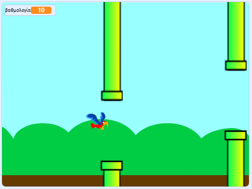

## Και τώρα;

Δοκίμασε το έργο [Flappy parrot](https://projects.raspberrypi.org/en/projects/flappy-parrot?utm_source=pathway&utm_medium=whatnext&utm_campaign=projects), όπου δημιουργείς ακόνη ένα παιχνίδι.

\--- no-print \---

Πάτησε την πράσινη σημαία για να ξεκινήσεις το παιχνίδι. Πατήστε το πλήκτρο <kbd>διάστημα</kbd> για να κάνεις τον παπαγάλο να χτυπήσει τα φτερά του και προσπάθησε να το πετάξεις μέσα από τα κενά στους σωλήνες! Κερδίζεις έναν πόντο για κάθε σωλήνα που καταφέρνει να περάσει.

  <iframe allowtransparency="true" width="485" height="402" src="https://scratch.mit.edu/projects/embed/258349724/?autostart=false" frameborder="0" scrolling="no"></iframe>
  

\--- /no-print \---

\--- print-only \---

Θα πατήσεις το πλήκτρο <kbd>διάστημα</kbd> για να κάνεις τον παπαγάλο να χτυπήσει τα φτερά του και να κερδίσει έναν βαθμό για κάθε σωλήνα που περνάει.

\--- /print-only \---