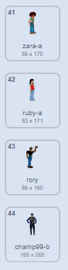

## Προσθήκη ενδυμασιών

--- task ---

Άνοιξε ένα νέο έργο Scratch.

**Online:** άνοιξε ένα νέο έργο Scratch στη διεύθυνση [rpf.io/scratch-new](http://rpf.io/scratch-new){:target="_blank"}.

**Eκτός σύνδεσης**: ανοίξτε ένα νέο project στο Scratch.

Αν χρειαστεί να κατεβάσεις και να εγκαταστήσεις τον offline editor για το Scratch, μπορείς να το βρεις στο [rpf.io/scratchoff](http://rpf.io/scratchoff){:target="_blank"}.

--- /task --- --- task ---

Πρόσθεσε μερικές ενδυμασίες στο αντικείμενο της γάτας. Πρέπει να προσθέσεις τουλάχιστον σαράντα διαφορετικές ενδυμασίες στο αντικείμενό σου.

Είναι προτιμότερο να επιλέξεις εικόνες από την ενότητα **Άνθρωποι**, αλλά αν θέλεις, μπορείς επίσης να επιλέξεις ενδυμασίες και από άλλες ενότητες.

[[[generic-scratch3-add-costume]]]

Μόλις έχεις τις ενδυμασίες σου, μπορείς να διαγράψεις τις αρχικές ενδυμασίες της γάτας, εάν θέλεις.

--- /task ---