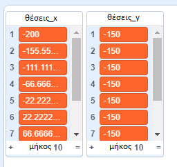

## Δοκίμασε το πρόγραμμα

\--- task \---

Για να ελέγξεις τον κώδικα, πρέπει να **καλέσεις** την εντολή σου και να της βάλεις ως είσοδο τον αριθμό `στήλες`{:class="block3myblocks"} που θέλεις στο πλέγμα σου.

Πρόσθεσε αυτόν τον κώδικα στο αντικείμενό σου:

```blocks3
when flag clicked
generate positions (1) (10) ::custom
```

\--- /task \---

\--- task \---

Τώρα κάνε κλικ στην πράσινη σημαία για να εκτελέσεις τον κώδικά σου. Θα πρέπει να δεις τις δύο λίστες να γεμίζουν με τιμές.



Εάν τα αποτελέσματα δεν μοιάζουν κάπως έτσι, γύρνα στο προηγούμενο βήμα, ρίξε μια ματιά στις οδηγίες και προσπάθησε να διορθώσεις τον κώδικα.

\--- /task \---