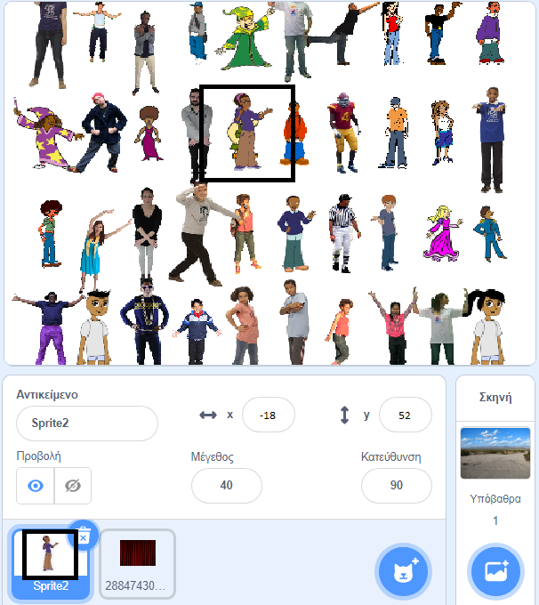

## Κρύψε το αντικείμενό σου

Τώρα ήρθε η ώρα να κρύψεις το αντικείμενό σου ανάμεσα στο πλήθος των σφραγίδων. Προς το παρόν, το αντικείμενο καλύπτει μια από τις σφραγίδες.



--- task ---

Έτσι, αυτό δεν συμβαίνει, κάνε το βρόχο σφραγίδων να τρέξει μια φορά λιγότερη: `(σειρές * στήλες) - 1`{:class="block3operators"}

```blocks3
define σφράγισε αντικείμενα (γραμμές) (στήλες)
set size to (40) %
+repeat (((γραμμές :: custom-arg) * (στήλες :: custom-arg)) - (1))
set [ευρετήριο v] to (pick random (1) to (length of [θέσεις_x v]))
go to x: (item (ευρετήριο) of [θέσεις_x v]) y: (item (ευρετήριο) of [θέσεις_y v]
delete (ευρετήριο) of [θέσεις_x v]
delete (ευρετήριο) of [θέσεις_y v]
stamp
next costume
```

--- /task ---

Εάν εκτελέσεις το πρόγραμμα τώρα, μπορείς να δεις ότι το αντικείμενο σου εξακολουθεί να επικαλύπτει μια σφραγίδα και υπάρχει μια τρύπα στο πλέγμα σου. Και στις λίστες `θέσεις_x`{:class="block3variables"} και `θέσεις_y`{:class="block3variables"}, παραμένει ένα ζευγάρι συντεταγμένων.

--- task ---

Για να ολοκληρώσεις αυτό το μέρος του παιχνιδιού, πήγαινε στον κώδικα για το `όταν γίνει κλικ σε πράσινη σημαία`{:class="block3events"}.

```blocks3
when flag clicked
erase all
δημιουργία θέσεων (4) (10) ::custom
σφράγισε αντικείμενα (4) (10) ::custom
```

--- no-print ---

Ακολουθεί μια κινούμενη εικόνα που δείχνει τι πρέπει να συμβεί:


--- /no-print ---

Στην αρχή του παιχνιδιού, το αντικείμενο θα πρέπει να εμφανίζεται σε μεγάλο μέγεθος και να λέει "Βρες με". Έπειτα το αντικείμενο πρέπει να κρύβεται ανάμεσα στις σφραγίδες στον κενό χώρο που έχεις αφήσει για αυτό.

Δες αν μπορείς να το κάνεις αυτό και χρησιμοποίησε τις παρακάτω οδηγίες εάν χρειάζεστε βοήθεια.

--- hints ---
 --- hint ---

Αυτό πρέπει να κάνει:

1. Στείλε το αντικείμενο στη θέση `x: 0 y: 0`{:class="block3motion"}
2. Φέρε το αντικείμενο στο `προσκήνιο`{:class="block3looks"} και όρισε το `μέγεθος σε 100%`{:class="block3looks"}
3. `Πες "Βρες με" για δύο δευτερόλεπτα`{:class="block3looks"}
4. `Πήγαινε πίσω ένα επίπεδο`{:class="block3looks"}
5. Όρισε το `μέγεθος σε 40%`{:class="block3looks"}
6. Πήγαινε στην τελευταία εναπομένουσα θέση στις λίστες

--- /hint --- --- hint ---

Εδώ είναι τα επιπλέον μπλοκ που χρειάζεσαι:

```blocks3
when flag clicked
erase all
δημιουργία θέσεων (4) (10) ::custom
σφράγισε αντικείμενα (4) (10) ::custom

go to x: (0) y: (0)

go back (1) layers

go to front

set size to (100) %

set size to (40) %

say [] for (2) seconds
item (1 v) of [θέσεις_x v]
item (1 v) of [θέσεις_y v]
go to x: () y: ()
```

--- /hint --- --- hint ---

Εδώ είναι το ολοκληρωμένο πρόγραμμα για το μπλοκ `όταν γίνει κλικ σε πράσινη σημαία`{:class="block3myblocks"}:

```blocks3
when flag clicked
erase all
δημιουργία θέσεων (4) (10) ::custom
σφράγισε αντικείμενα (4) (10) ::custom
+go to x: (0) y: (0)
+go to front
+set size to (100) %
+say [Βρες με] for (2) seconds
+go back (1) layers
+set size to (40) %
+ go to x: (item (1 v) of [θέσεις_x v]) y: (item (1 v) of [θέσεις_y v])
```

--- /hint ------ /hints --- --- /task ---