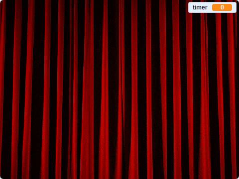

## Τελείωσε το παιχνίδι

--- task ---

Για να ολοκληρώσεις το παιχνίδι, [βρες και κατέβασε μια εικόνα από μια κουρτίνα σκηνής](https://www.google.co.uk/search?q=stage+curtain&source=lnms&tbm=isch&sa=X&ved=0ahUKEwjKg9O1k8_VAhXSL1AKHe1HDMIQ_AUICigB&biw=1362&bih=584){:target="_blank"}.

Βάλε αυτήν την εικόνα ως αντικείμενο.

[[[generic-scratch3-add-sprite-from-file]]]

--- /task ---

--- task ---

Τοποθέτησε το νέο αντικείμενο της κουρτίνας στη θέση `x: 0 y: 0`{:class="block3motion"} και, στη συνέχεια, άλλαξε το μέγεθός του, ώστε να γεμίζει την οθόνη. Βεβαιώσου ότι είναι ορατό.

```blocks3
when flag clicked
go to x: (0) y: (0)
set size to (110) %
show
```

--- /task ---

--- task ---

Στη συνέχεια, στα σενάρια για το χαρακτήρα σου, πρόσθεσε ένα `μήνυμα`{:class="block3events"} με ονομασία "κουρτίνα πάνω" στο τέλος του κώδικα `όταν γίνει κλικ σε πράσινη σημαία`{:class="block3events"}.

```blocks3
when flag clicked
erase all
δημιουργία θέσεων (4) (10) ::custom
σφράγισε αντικείμενα (4) (10) ::custom
go to x: (0) y: (0)
go to front
set size to (100) %
say [Βρες με] for (2) seconds
go back (1) layers
set size to (40) %
go to x: (item (1 v) of [θέσεις_x v]) y: (item (1 v) of [θέσεις_y v])
+broadcast (κουρτίνα πάνω v)
```

--- /task ---

--- task ---

Όταν το αντικείμενο της κουρτίνας λάβει το `μήνυμα`{:class="block3events"}, το αντικείμενο πρέπει να κινηθεί προς τα πάνω για 10 δευτερόλεπτα, έτσι ώστε να φαίνεται ότι η κουρτίνα έχει ανυψωθεί για να αποκαλύψει τις σφραγίδες. Στη συνέχεια, η κουρτίνα πρέπει να πέσει και πάλι, έτσι το αντικείμενο κουρτίνα πρέπει να κινηθεί προς τα κάτω.

--- no-print ---

Θα μοιάζει έτσι:



--- /no-print ---

Προσπάθησε να το κάνεις μόνος σου και χρησιμοποίησε τις υποδείξεις εάν χρειάζεσαι βοήθεια.

--- hints ---
 --- hint ---

Για το αντικείμενο της κουρτίνας, χρειάζεσαι ένα πρόγραμμα που κάνει τα ακόλουθα πράγματα:

1. Όταν το αντικείμενο κουρτίνα λάβει το `μήνυμα`{:class="block3events"}
2. Φέρε το αντικείμενο κουρτίνα στο `προσκήνιο`{:class="block3looks"}
3. `Περίμενε`{:class="block3control"} λίγο ενώ οι ενδυμασίες σφραγίζονται
4. `Ολίσθησε`{:class="block3motion"} την κουρτίνα προς τα πάνω, έτσι ώστε να καταλήξει κοντά στην κορυφή της σκηνής
5. `Εξαφάνισε`{:class="block3looks"} την κουρτίνα
6. Ξεκίνα ένα βρόχο που μετράει για 10 δευτερόλεπτα
7. Όταν τελειώσει ο χρόνος, `εμφάνισε`{:class="block3looks"} την κουρτίνα
8. `Ολίσθησε`{:class="block3motion"} το αντικείμενο κουρτίνα πίσω στην αρχική του θέση

--- /hint --- --- hint ---

Εδώ είναι τα μπλοκ που χρειάζεσαι:

```blocks3
go to front

show

hide

glide (1) secs to x: (0) y: (0)

glide (1) secs to x: (0) y: (0)

set [χρονόμετρο v] to []

change [χρονόμετρο v] by ()

wait () secs

wait () secs

repeat ()
end
when I receive [κουρτίνα πάνω v]
```

--- /hint --- --- hint ---

Αυτό είναι το ολοκληρωμένο πρόγραμμα:

```blocks3
when I receive [κουρτίνα πάνω v]
go to front
wait (1) seconds
glide (1) secs to x: (0) y: (300)
hide
set [χρονόμετρο v] to [10]
repeat (10)
wait (1) seconds
change [χρονόμετρο v] by (-1)
end
show
glide (1) secs to x: (0) y: (0)
```

--- /hint ------ /hints --- --- /task ---

Το τελευταίο μέρος είναι να ενημερώσεις τον παίκτη εάν έχει κερδίσει.

--- task ---

Στις εντολές για το αντικείμενο του χαρακτήρα, πρόσθεσε κώδικα έτσι ώστε, όταν κάνεις κλικ στο αντικείμενο, αυτό να λέει `Με βρήκες!`{:class="block3looks"} και όλα τα σενάρια στο παιχνίδι να σταματούν.

```blocks3
when this sprite clicked
say [Με βρήκες]
stop [all v]
```

--- /task ---