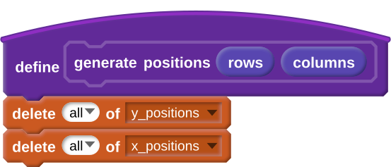
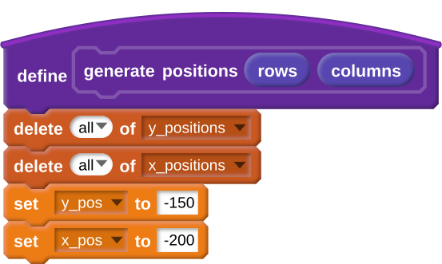
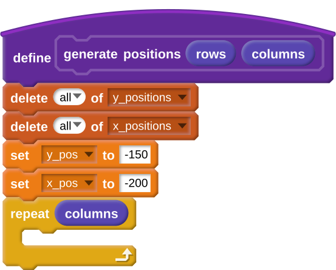
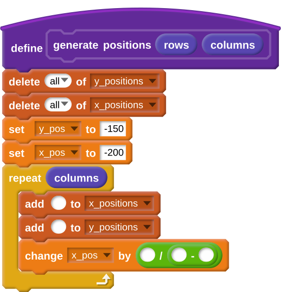
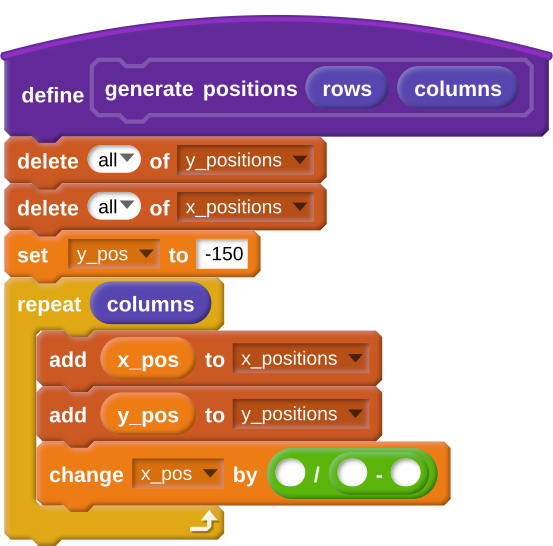
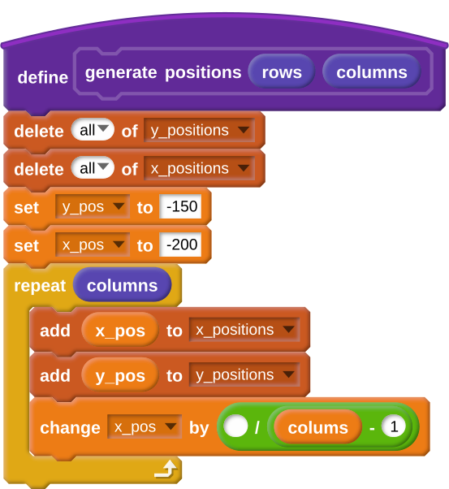
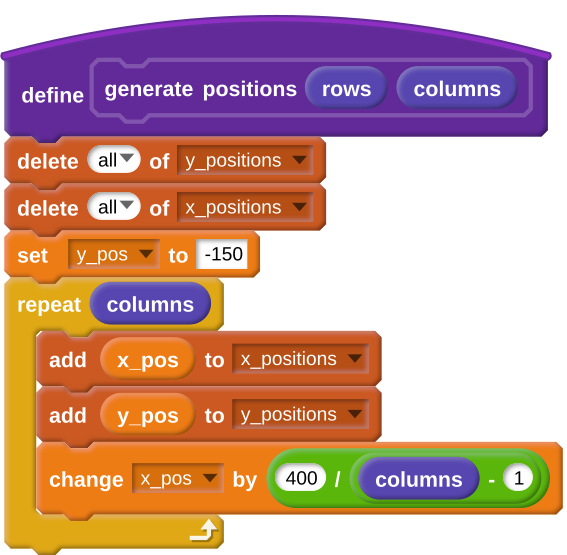

## Making a grid

- You are going to produce a grid of stamped costumes, just like this one:

	
	
- To do this you will need to know the `x` and `y` coordinates of where each stamp is going to be placed. Have a look at the section below if you need a reminder about Scratch coordinates.

[[[generic-scratch-coordinates]]]

- To begin with you'll need to create a new block called `generate positions` for your sprite. The block will need to have two 'number input' parameters. Call the two parameters `rows` and `columns`. The values of these parameters will define how many rows and columns your grid will have.

	

[[[generic-scratch-make-block]]]

- Next you will need to create two lists. One will be called `x_positions`, and the other will be called `y_positions`.

[[[generic-scratch-make-list]]]

- Underneath your `generate positions` block, add blocks to delete all the items from both lists.

	

- Next you will need to create two new variables. Call these `x_pos` and `y_pos`.

[[[generic-scratch-add-variable]]]

- Your two lists are going to hold all the `x` and `y` coordinates for the characters on the stage. If you look at the two lists side by side, as shown in the table below, you will see that the first index will correspond to the bottom left-hand corner of the stage. The next one will be a little bit to the right , and so on.

|index|y_positions|x_positions|
|-----|-----------|-----------|
|1    |-150       |-200       |
|2    |-150       |-155       |
|3    |-150       |-111       |
|4    |-150       |-66        |
|5    |-150       |-22        |
|6    |-150       |22         |
|7    |-150       |66         |
|8    |-150       |111        |
|9    |-150       |155        |
|10   |-150       |200        |

- The table shows the coordinates of the first row of images. They could be added to the lists manually, but that would take a little too much time. It's easier to do it with a loop.

- Start by setting the `y_pos` and `x_pos` variables to `-150` and `-200`. This will be the location of the first image.

	
	
- Now you need a loop to add the first ten coordinates to the lists. So how many times should the loop repeat? In this case it is ten - one time for each column in the grid. As you've set up the block to take `columns` as a parameter, you can use this value.

	
	
- Within the loop, you'll need to add the values of `x_pos` and `y_pos` into the lists. Then you'll need to increase the value of `x_pos` by a little. The first value you added is `-200` and the next is approximately `-155`, up until you reach `200`. So how can you calculate these increments? Well, as you want a total of ten values in the list, and the first is already set to `200`, you need an additional nine values. This is the value of `columns` minus one, so `columns - 1`. You want to go up to `200`, so you'll need to add an additional `400` to `x_pos`. This means you want to add `400 / (columns - 1)` each time the loop comes around.

- Here's some code to get you started, and you can use the hints below if you need more help.

	
	
--- hints --- --- hint ---
- Start by adding the variable values into the lists.
    
--- /hint --- --- hint ---
- Now use the `columns` parameter to calculate the number of repeats.
	
--- /hint --- --- hint ---
- Lastly you can add in `400` to the calculation, so it calculates the increase in `x_pos` each time.
	
--- /hint --- --- /hints ---
