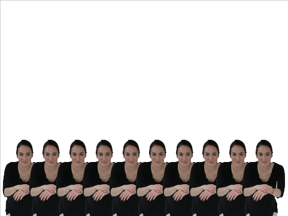

## Stamping a row

So far you have ten values in the two lists. Let's stamp some costumes at the stage positions given in the list.

--- task ---
Create a new block and call it `stamp sprites`{:class="blockmoreblocks"}. It needs two parameters as well, both of which should be number inputs and named `row`{:class="blockmoreblocks"} and `columns`{:class="blockmoreblocks"} just like the last ones.

```blocks
define stamp sprites (rows) (columns)
```
--- /task ---

--- task ---
Create a new variable called `index`{:class="blockdata"}. You can use this to track which position in the lists you are reading. Set it to `1`{:class="blockdata"} to begin with, to fetch the first item of each lists.

```blocks
define stamp sprites (rows) (columns)
set [index v] to [1]
```
--- /task ---

--- task ---

Now you're going to stamp a sprite for each set of coordinates in the list. This will require a loop that will repeat once for each column.

```blocks
define stamp sprites (rows) (columns)
set [index v] to [1]
repeat (columns)
```
--- /task ---	

--- task ---
Within the loop, move your sprite to the `index`{:class="blockdata"} position in `x_positions`{:class="blockdata"} and `y_positions`{:class="blockdata"}, stamp it, then increase the `index`{:class="blockdata"} by 1.

--- hints --- --- hint ---
Within the loop you'll need to place a, `go to x: y:`{:class="blockmotion"} block. The `x`{:class="blockmotion"} position should be set to the `index`{:class="blockdata"} of `x_positions`{:class="blockdata"} and the `y`{:class="blockmotion"} position shoudl be set to the `index`{:class="blockdata"} of `y_positions`{:class="blockdata"}. You can then `stamp`{:class="blockpen"} the sprite and increase `index`{:class="blockdata"} by 1.
--- /hint --- --- hint ---
Here's the blocks you will need
```blocks
define stamp sprites (rows) (columns)
set [index v] to [1]
repeat (columns)
end

change [index v] by (1)
(index) 
(index) 
go to x: () y: ()
(item ()of [y_positions v])
(item ()of [x_positions v])
stamp
```
--- /hint --- --- hint ---
Here's the completed script
```blocks
define stamp sprites (rows) (columns)
set [index v] to [1]
repeat (columns)
go to x: (item (index) of [x_positions v]) y: (item (index) of [y_positions v]
stamp
change [index v] by (1)
```
--- /hint --- --- /hints ---
--- /task ---

--- task ---
Next you need to call this block as well. You should also add a `clear`{:class="blockpen"} block to your starting script so that it clears the stage each time.

```blocks
when flag clicked
clear
generate positions (1) (10) ::custom
stamp sprite (1) (10) ::custom
```
--- /task ---	

--- task ---
When you click the green flag, you should see something like this, depending on the costumes you have used:


--- /task ---

