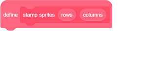
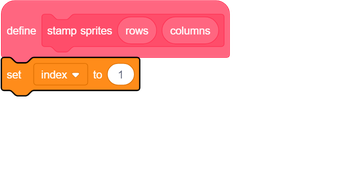
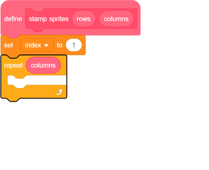
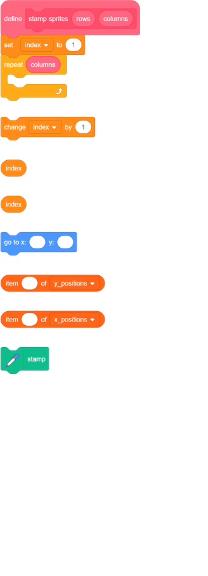
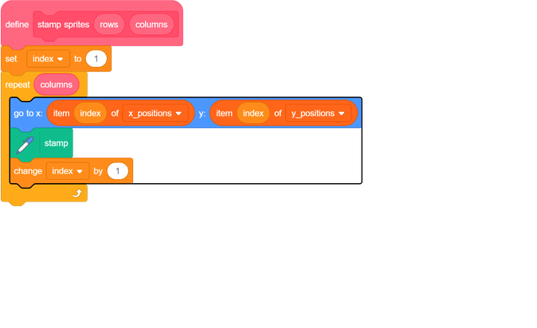
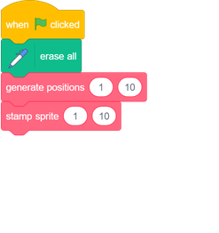

## Stamp a row

So far you have ten values in each of the two lists. Now stamp some costumes at the Stage coordinates stored in the lists.

--- task ---

Add the **Pen** extension to your project.

[[[generic-scratch3-add-pen-extension]]]

--- /task ---

--- task ---
Create a new block and call it `stamp sprites`{:class="block3myblocks"}. This block needs two number inputs named `row`{:class="block3myblocks"} and `columns`{:class="block3myblocks"} just like the other custom block.

--- /task ---

--- task ---
Create a new variable called `index`{:class="block3variables"} with which to track the position in the lists that your program is reading. To begin with, set `index`{:class="block3variables"} to `1`{:class="block3variables"} to fetch the first item of each list.

--- /task ---

--- task ---

The `stamp sprites`{:class="block3myblocks"} block should stamp a sprite for each pair of coordinates in the list. To do this, the block needs a `repeat`{:class="block3variables"} loop that runs once for each column.

--- /task ---	

--- task ---
Within the `repeat`{:class="block3variables"} loop:
 - Move the sprite to the `index`{:class="block3variables"} position in the `x_positions`{:class="block3variables"} and `y_positions`{:class="block3variables"} lists
 - `Stamp`{:class="block3extensions"} the sprite
 - Change the `index`{:class="block3variables"} by `1`{:class="block3variables"}

--- hints --- --- hint ---

Within the `repeat`{:class="block3variables"} loop, add a `go to x: y:`{:class="block3motion"} block. The `x`{:class="block3motion"} position in this block should be set to the `index`{:class="block3variables"} of `x_positions`{:class="block3variables"} and the `y`{:class="block3motion"} position should be set to the `index`{:class="block3variables"} of `y_positions`{:class="block3variables"}. Then add code to `stamp`{:class="block3extensions"} the sprite. Finally, add code to increase `index`{:class="block3variables"} by 1.

--- /hint --- --- hint ---
Here are the blocks you need:

--- /hint --- --- hint ---
Here is the completed script for the `stamp sprites`{:class="block3myblocks"} block:

--- /hint --- --- /hints ---
--- /task ---

--- task ---
Add a `erase all`{:class="block3extensions"} block below the `when flag clicked`{:class="block3control"} block to clear the Stage each time the game starts. Then add the `stamp sprites`{:class="block3myblocks"} block at the bottom of the `when flag clicked`{:class="block3control"} script so you can test your new code.

--- /task ---	

--- task ---
Click the green flag. You should see something like this, depending on the costumes your sprite has:

--- /task ---

