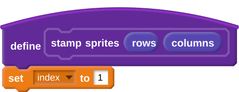
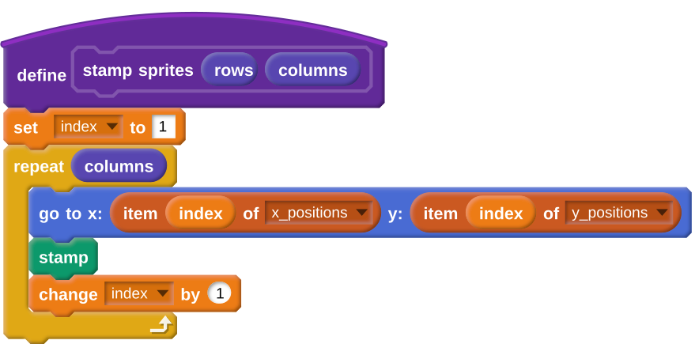
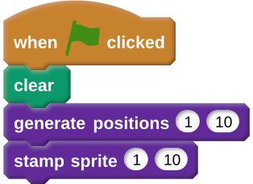

## Stamping a row
- So far you have ten values in the two lists. Let's stamp some costumes at the stage positions given in the list.

- Create a new block and call it `stamp sprites`. It needs two parameters as well, both of which should be number inputs and named `row` and `columns` just like the last ones.

	

- Create a new variable called `index`. You can use this to track which position in the list you are reading. Set it to `1`.

	

- Now you're going to stamp a sprite for each set of coordinates in the list. This will require a loop that will repeat once for each column.

	
	
- Within the loop, move your sprite to the first position in the list, stamp it, then increase the `index` by 1.

	

- Next you need to call this block as well. You should also add a `clear` block to you starting script so that it clears the stage each time.

	
	
- When you click the green flag, you should see something like this:

	
