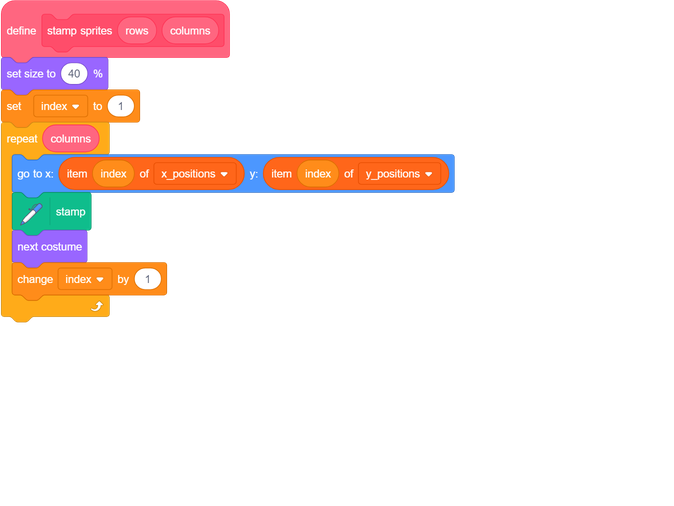
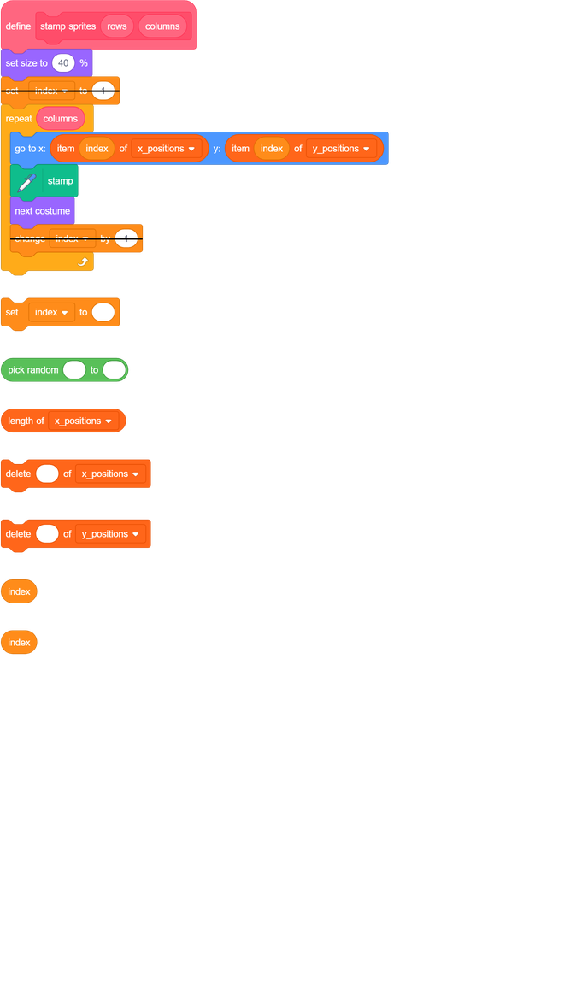
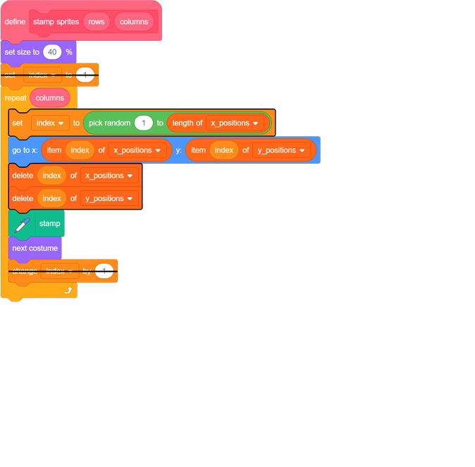

## Change the costumes

At the moment, your program stamps the same sprite costume over and over, and the size of the costume is too large.

--- task ---
Add code to the `stamp sprites`{:class="block3myblocks"} block to make the sprite a suitable size before the `repeat`{:class="block3control"} loop starts. Add a block inside the loop to switch the `next costume`{:class="block3looks"} after the `stamp`{:class="block3extensions"} block.

--- /task ---

When you run the script now, you should see something like this:

	
Your program cycles through all the costumes in order. So that each costume does not show up in the same place every time the program runs, you should stamp the sprite in random places on the grid.

To do this, you need to follow this **algorithm**:
  1. `Repeat`{:class="block3control"} until the list is empty
  1. Set `index`{:class="block3variables"} to a `random`{:class="block3operators"} number between `1` and the length of a list
  2. Move the sprite as you did before
  3. Delete the item at the `index`{:class="block3variables"} position from the `y_positions`{:class="block3variables"} list
  4. Delete the item at the `index`{:class="block3variables"} position from the `x_positions`{:class="block3variables"} list
  
--- task ---

Add code to stamp the sprite in random places on the grid.

--- hints --- --- hint ---
Remove the `set index to 1`{:class="block3variables"} from before the `repeat`{:class="block3control"} loop.

Then within the loop, `set index to `{:class="block3variables"} a `random`{:class="block3operators"} number between `1` and the `length of x_positions`{:class="block3variables"}.

Then `delete`{:class="block3variables"} the item at the `index`{:class="block3variables"} from both the `x_positions`{:class="block3variables"} and `y_positions`{:class="block3variables"} lists.
--- /hint --- --- hint ---

Here are the additional blocks you need:

--- /hint --- --- hint ---

This is what your code should look like:

--- /hint --- --- /hints ---
--- /task ---
