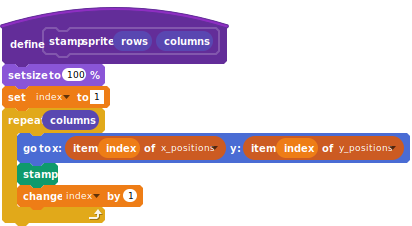
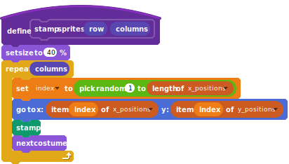

## Changing the costumes.

- Let's change the stamp each time and make it a more appropriate size.

	
	
- When you run the script it should now look something like this:

	
	
- At the moment, your program cycles through all the costumes in order. This isn't a problem, so long as you place the sprite in a ranom location each time.

- To do this, you'll need to follow the following **algorithm**:
  1. Set `index` to a random number between `1` and the lenght of a list
  2. Move the sprite as you did before
  3. Delete the `index` position from the `y_positions` list
  4. Delete the `index` position from the `x_positions` list
  
- Have a go at doing this part yourself and have a look at the hints if you need some help.

--- hints --- --- hint ---
- Here's how you can pick a random number from within the list
  
--- /hint --- --- hint ---
- Here's how to pick a random item from the list
  
--- /hint --- --- hint ---
- Here is your completed script showing how to delete the items from the list.
  
--- /hint --- --- /hints ---
