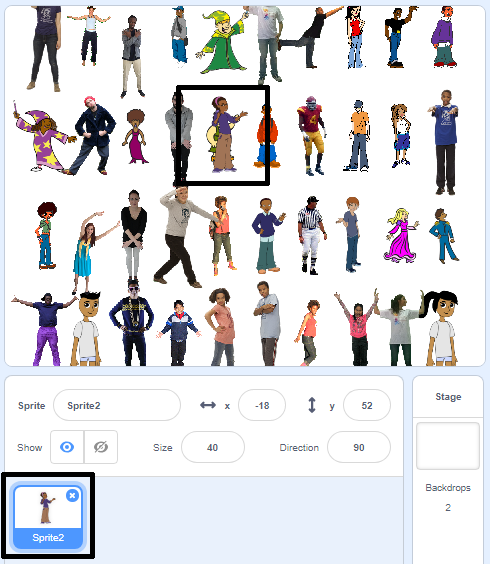
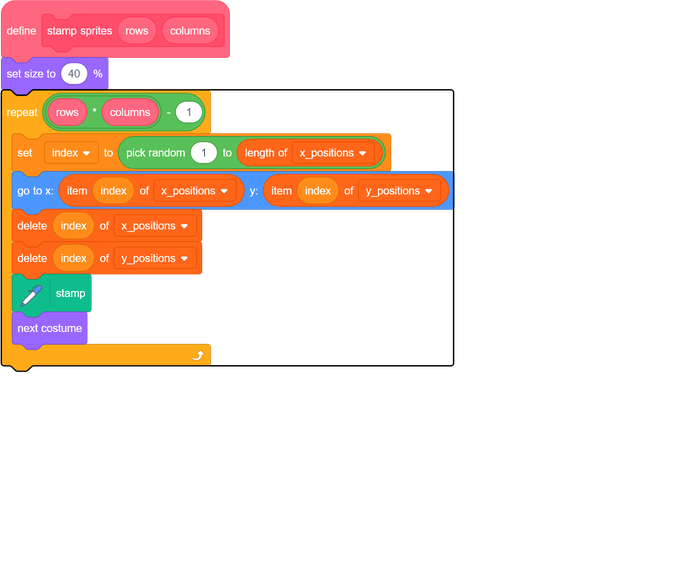
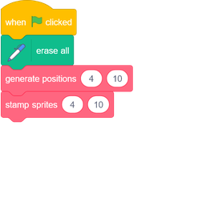
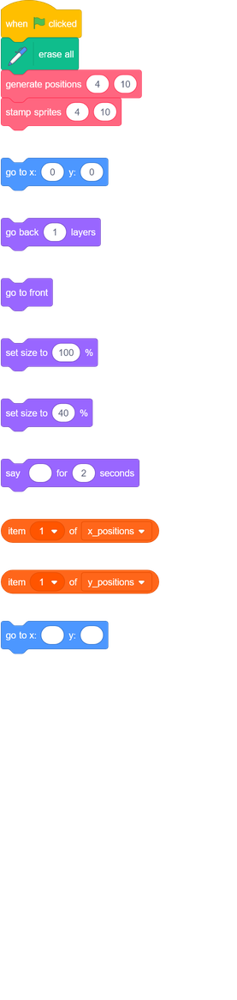
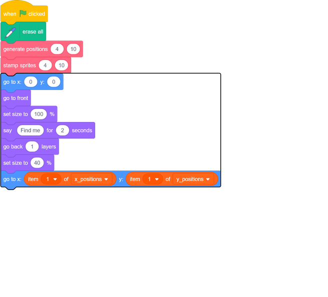

## Hide your sprite

Now it's time to hide your sprite among the crowd of stamps. At the moment the sprite overlaps one of the stamps.

--- task ---
So this doesn't happen, make your stamp loop run one time less: `(rows * columns) - 1`{:class="block3operators"}

--- /task ---

If you run the script now, you can see that your sprite still overlaps with a stamp and there is a hole in your grid. And in the `x_positions`{:class="block3variables"} and `y_positions`{:class="block3variables"} lists, there is one coordinate position left.

--- task ---
To finish this part your game, go to the `when flag clicked`{:class="block3events"} section of the scripts.

--- no-print ---
Here's an animation showing what should happen:

--- /no-print ---

At the start of the game, the sprite should appear at a large size and say "Find me". Then the sprite should hide itself among the stamps in the empty space you have left for it.

See if you can figure out how to do this, and use the hints below if you need help.

--- hints --- --- hint ---
This is what it needs to do:
  1. Send your sprite to `x:0 y:0`{:class="block3motion"}
  2. Bring the sprite to the `front`{:class="block3looks"} and set its `size to 100%`{:class="block3looks"}
  3. `Say 'Find me' for two seconds`{:class="block3looks"}
  4. `Go back one layer`{:class="block3looks"}
  5. Set the sprite's `size to 40%`{:class="block3looks"}
  6. Move to the last remaining position in the lists
--- /hint --- --- hint ---
These are the additional blocks you need:

--- /hint --- --- hint ---
Here is the completed `when flag clicked`{:class="block3events"} script:

--- /hint --- --- /hints ---
--- /task ---
