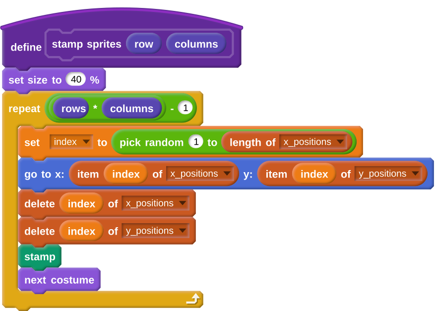
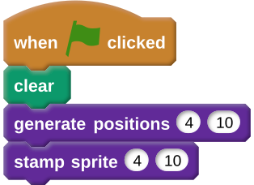
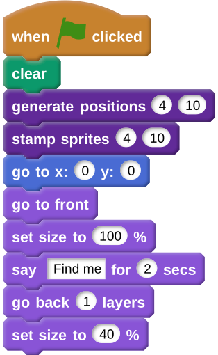
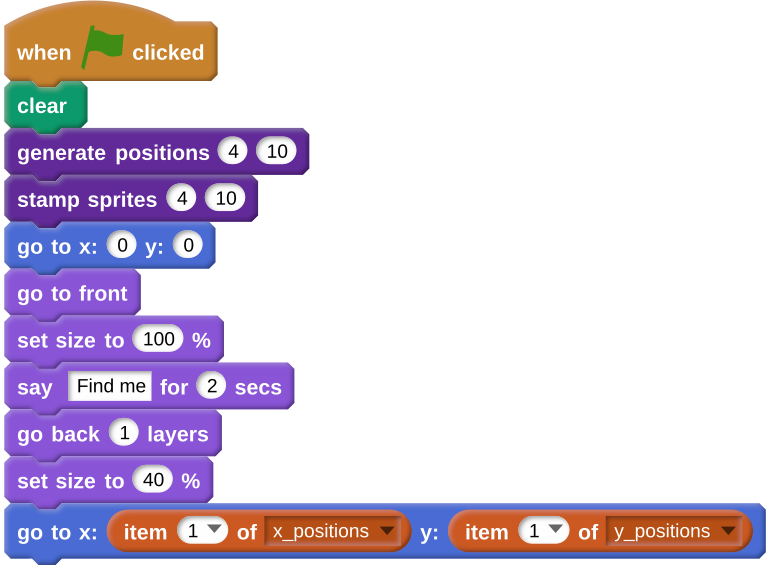

## Placing your sprite

- Now it's time to position your sprite amongst the stamps. You'll notice at the moment that your sprite will overlap one of the stamps.

	

- So this doesn't happen, you can just make your stamp loop run one time less: `(rows * columns) - 1`

	
	
- If you run the script now, then your sprite still overlaps with a stamp, but there should be a hole in your grid of stamps. If you look have your `x_positions` and `y_positions` list, then you'll also see that there is one coordinate position left.

- To finish off this part the game, you'll need to continue the **green flag** section of the scripts.

	
	
- Here's what it needs to do:
  1. Send your sprite to `x:0 y:0`
  2. Bring the sprite to the front and set its size to 100%
  3. Say `Find me` for two seconds
  4. Move back one layer
  5. Set the sprite's size to 40%
  6. Move to the last remaining position in the lists
  
- Here's an animation showing what should happen
  
  
- See if you can do this independently, and use the hints below if you need more help.

--- hints --- --- hint ---
- The first part is fairly simple:
  
--- /hint --- --- hint ---
- To move your sprite to the correct location, you can use this code:
  
--- /hint --- --- /hints ---
