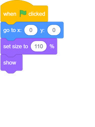
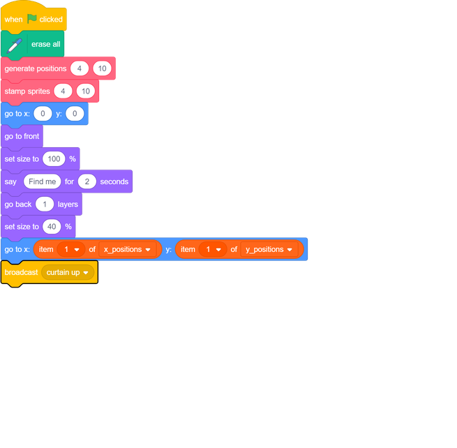
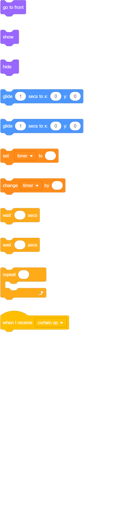
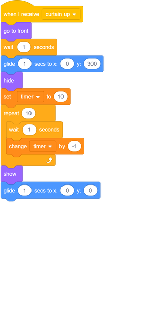
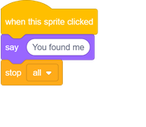

## Finish the game

--- task ---
To finish the game, [find and download an image of a stage curtain](https://www.google.co.uk/search?q=stage+curtain&source=lnms&tbm=isch&sa=X&ved=0ahUKEwjKg9O1k8_VAhXSL1AKHe1HDMIQ_AUICigB&biw=1362&bih=584){:target="_blank"}.

Import this image as a sprite.

[[[generic-scratch3-add-sprite-from-file]]]
--- /task ---

--- task ---
Position the new curtain sprite at `x:0 y:0`{:class="block3motion"}, and then change its size so that it fills the screen. Make sure it is visible.

--- /task ---

--- task ---
Then, in the scripts for your character sprite, add a `broadcast`{:class="block3events"} with the message 'curtain up' to the end of the `when flag clicked`{:class="block3events"} script.

--- /task ---

--- task ---

When the curtain sprite receives the `broadcast`{:class="block3events"}, the sprite needs to move upwards for 10 seconds so that it looks like the curtain is raised to reveal the stamps. Then the curtain should drop again, so the curtain sprite needs to move downwards.

--- no-print ---
It should look like this:

--- /no-print ---

Try to do this by yourself, and use the hints if you need help.

--- hints --- --- hint ---
For the curtain sprite, you need a script that does the following things:
  1. When the curtain sprite receives the `broadcast`{:class="block3events"}
  1. Bring the curtain sprite to the `front`{:class="block3looks"}
  1. `Wait`{:class="block3control"} a little bit while the character sprite costumes get stamped
  1. `Glide`{:class="block3motion"} the curtain sprite upwards so it ends up near the top of the Stage
  1. `Hide`{:class="block3looks"} the curtain
  1. Start a loop that counts down for 10 seconds
  1. When the time is over, `show`{:class="block3looks"} the curtain sprite
  1. `Glide`{:class="block3motion"} the curtain sprite back to its original position
--- /hint --- --- hint ---
Here are the blocks you need:

--- /hint --- --- hint ---
 This is the completed script:

--- /hint --- --- /hints ---
--- /task ---

The very last part is to let the player know if they've won.

--- task ---
In the scripts for the the character sprite, add code so that, when the sprite is clicked, the sprite says `You've found me`{:class="block3looks"}, and all the scripts in the game stop.
	

--- /task ---

