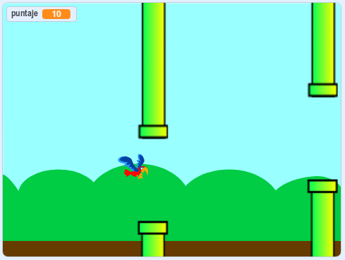

## ¿Qué sigue?

Prueba el proyecto [El papagayo Plumita](https://projects.raspberrypi.org/es-LA/projects/flappy-parrot?utm_source=pathway&utm_medium=whatnext&utm_campaign=projects), en el cual creas otro juego.

--- no-print ---

Haz clic en la bandera verde para comenzar el juego. ¡Pulsa la barra <kbd>espacio</kbd> para hacer que el loro agite sus alas, e intenta que vuele a través de los huecos en las tuberías! Obtienes un punto por cada tubería que consigues hacer pasar al loro.

  <iframe allowtransparency="true" width="485" height="402" src="https://scratch.mit.edu/projects/embed/417553863/?autostart=false" frameborder="0" scrolling="no"></iframe>
  

--- /no-print ---

--- print-only ---

Pulsarás la barra <kbd>espacio</kbd> para hacer que el loro agite sus alas, y anotarás un punto por cada tubería que consigas hacer pasar al loro.

--- /print-only ---

***
Este proyecto fue traducido por voluntarios:

Margarita Quiroz-Cariga (Fitzpatrick)

Ana Luisa Cubas Córdova

Gracias a los voluntarios, podemos dar a las personas de todo el mundo la oportunidad de aprender en su propio idioma. Puedes ayudarnos a llegar a más personas ofreciéndote como voluntario para traducir. Más información en [rpf.io/translate](https://rpf.io/translate).