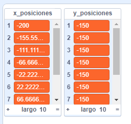

## Prueba el script

--- task ---

Para probar el script, necesitas **llamar** al bloque personalizado y proporcionarle el número de `columnas`{:class="block3myblocks"} que quieres en tu cuadrícula.

Añade este código a tu objeto:

```blocks3
when flag clicked
generar posiciones (1) (10) ::custom
```

--- /task ---

--- task ---

Ahora haz clic en la bandera verde para ejecutar tu código. Deberías ver tus dos listas llenas de valores.



Si tus resultados no se ven así, vuelve al paso anterior, echa un vistazo a las pistas, e intenta arreglar tu script.

--- /task ---