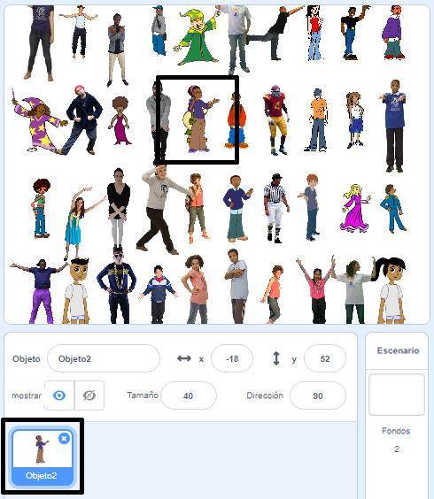

## Oculta tu objeto

Ahora es el momento de ocultar tu objeto entre la multitud de sellos. En este momento el objeto se superpone a uno de los sellos.



\--- task \---

Para que esto no suceda, haz que tu bucle de sellos se ejecute una vez menos: `(filas * columnas) - 1`{:class="block3operators"}

```blocks3
define stamp sprites (rows) (columns)
set size to (40) %
+repeat (((rows :: custom-arg) * (columns :: custom-arg)) - (1))
set [index v] to (pick random (1) to (length of [x_positions v]))
go to x: (item (index) of [x_positions v]) y: (item (index) of [y_positions v]
delete (index) of [x_positions v]
delete (index) of [y_positions v]
stamp
next costume
```

\--- /task \---

Si ejecutas tu script ahora, puedes ver que tu objeto aún se superpone con un sello y que hay un agujero en tu cuadrícula. Y en las listas `x_posiciones`{:class="block3variables"} y `y_posiciones`{:class="block3variables"}, queda una posición de coordenada.

\--- task \---

Para finalizar esta parte de tu juego, ve a la sección `al presionar la bandera` {:class="block3events"} de los scripts.

```blocks3
when flag clicked
erase all
generate positions (4) (10) ::custom
stamp sprites (4) (10) ::custom
```

\--- no-print \---

Aquí hay una animación que muestra lo que debería suceder:


\--- /no-print \---

Al comienzo del juego, el objeto debe aparecer en un tamaño grande y decir “Encuéntrame”. Entonces el objeto debería esconderse entre los sellos en el espacio vacío que le has dejado.

Comprueba si puedes averiguar cómo hacer esto, y usa las pistas a continuación si necesitas ayuda.

\--- hints \--- \--- hint \---

Esto es lo que tienes que hacer:

1. Enviar tu objeto a `x:0 y:0`{:class="block3motion"}
2. Traer el objeto al `frente`{:class="block3looks"} y fijar su `tamaño a 100%`{:class="block3looks"}
3. `Decir “Encuéntrame” por dos segundos`{:class="block3motion"}
4. `Ir una capa hacia atrás`{:class="block3motion"}
5. Fijar el `tamaño al 40%`{:class="block3motion"} del objeto
6. Mover a la última posición restante en las listas

\--- /hint \--- \--- hint \---

Estos son los bloques adicionales que necesitas:

```blocks3
when flag clicked
erase all
generate positions (4) (10) ::custom
stamp sprites (4) (10) ::custom

go to x: (0) y: (0)

go [backward v] (1) layers

go to [front v] layer

set size to (100) %

set size to (40) %

say [] for (2) seconds
item (1 v) of [x_positions v]
item (1 v) of [y_positions v]
go to x: () y: ()
```

\--- /hint \--- \--- hint \---

Aquí está el script `al presionar la bandera`{:class="block3events"} completado:

```blocks3
when flag clicked
erase all
generate positions (4) (10) ::custom
stamp sprites (4) (10) ::custom
+go to x: (0) y: (0)
+go to [front v] layer
+set size to (100) %
+say [Find me] for (2) seconds
+go [backward v] (1) layers
+set size to (40) %
+ go to x: (item (1 v) of [x_positions v]) y: (item (1 v) of [y_positions v])
```

\--- /hint \--- \--- /hints \--- \--- /task \---