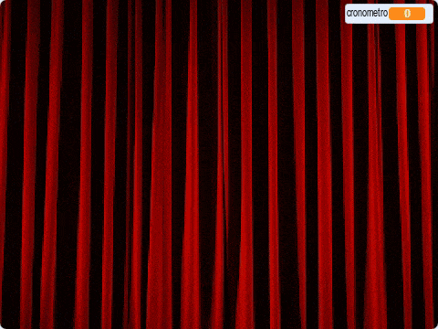

## Termina el juego

--- task ---

Para terminar el juego, [encuentra y descarga una imagen de un telón de escenario](https://www.google.co.uk/search?q=stage+curtain&source=lnms&tbm=isch&sa=X&ved=0ahUKEwjKg9O1k8_VAhXSL1AKHe1HDMIQ_AUICigB&biw=1362&bih=584){:target="_blank"}.

Importa esta imagen como un objeto.

[[[generic-scratch3-add-sprite-from-file]]]

--- /task ---

--- task ---

Coloca el nuevo objeto de telón en `x:0 y:0`{:class="block3motion"}, y luego cambia su tamaño para que llene la pantalla. Asegúrate de que sea visible.

```blocks3
when flag clicked
go to x: (0) y: (0)
set size to (110) %
show
```

--- /task ---

--- task ---

Luego, en los scripts para el objeto de tu personaje, añade un `anuncio`{:class="block3events"} con el mensaje 'telón arriba' al final del script `al presionar la bandera`{:class="block3events"}.

```blocks3
when flag clicked
erase all
generar posiciones (4) (10) ::custom
sellar objetos (4) (10) ::custom
go to x: (0) y: (0)
go to front
set size to (100) %
say [Encuéntrame] for (2) seconds
go back (1) layers
set size to (40) %
go to x: (item (1 v) of [x_posiciones v]) y: (item (1 v) of [x_posiciones v])
+broadcast (telón arriba v)
```

--- /task ---

--- task ---

Cuando el objeto del telón recibe el `anuncio`{:class="block3events"}, el objeto necesita moverse hacia arriba durante 10 segundos para que parezca que la cortina se levanta para revelar los sellos. Entonces el telón debe volver a caer, así que el objeto del telón necesita moverse hacia abajo.

--- no-print ---

Debería verse así:



--- /no-print ---

Intenta hacer esto por ti mismo y usa las sugerencias si necesitas ayuda.

--- hints ---
 --- hint ---

Para el objeto del telón, necesitas un script que haga las siguientes cosas:

1. Cuando el objeto del telón recibe el `anuncio`{:class="block3events"}
2. Traer el objeto del telón hacia el `frente`{:class="block3looks"}
3. `Esperar`{:class="block3control"} un poco mientras los objetos de disfraces del personaje se sellan
4. `Deslizar`{:class="block3motion"} el objeto del telón hacia arriba para que termine cerca de la parte superior del escenario
5. `Ocultar`{:class="block3looks"} la cortina
6. Iniciar un bucle que cuente hacia atrás por 10 segundos
7. Cuando se acabe el tiempo, `mostrar`{:class="block3looks"} el objeto de telón
8. `Deslizar`{:class="block3motion"} el objeto telón de regreso a su posición original

--- /hint --- --- hint ---

Aquí están los bloques que necesitas:

```blocks3
go to front

show

hide

glide (1) secs to x: (0) y: (0)

glide (1) secs to x: (0) y: (0)

set [cronometro v] to []

change [cronometro v] by ()

wait () secs

wait () secs

repeat ()
end
when I receive [telón arriba v]
```

--- /hint --- --- hint ---

Este es el script completado:

```blocks3
when I receive [telón arriba v]
go to front
wait (1) seconds
glide (1) secs to x: (0) y: (300)
hide
set [cronometro v] to [10]
repeat (10)
wait (1) seconds
change [cronometro v] by (-1)
end
show
glide (1) secs to x: (0) y: (0)
```

--- /hint ------ /hints --- --- /task ---

La última parte es informar al jugador si ha ganado.

--- task ---

En los scripts para el objeto de caracteres, añade código para que, cuando se haga clic en el objeto, el objeto diga `Me has encontrado`{:class="block3looks"}, y todos los scripts en el juego se detengan.

```blocks3
when this sprite clicked
say [Me has encontrado]
stop [all v]
```

--- /task ---