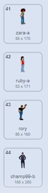

## Ajouter des costumes

---task ---

Ouvre un nouveau projet Scratch.

**En ligne :** ouvre un nouveau projet Scratch en ligne sur [rpf.io/scratch-new](http://rpf.io/scratch-new){:target="_blank"}.

**Hors ligne :**  ouvre un nouveau projet dans l'éditeur hors ligne.

Si tu dois télécharger et installer l'éditeur hors ligne Scratch, tu peux le trouver sur [rpf.io/scratchoff](http://rpf.io/scratchoff){:target="_blank"}.

--- /task --- --- task ---

Ajoute plus de costumes au sprite chat. Tu dois ajouter au moins quarante costumes différents pour ton sprite.

Il est préférable de sélectionner des costumes dans la section **Gens** , mais si tu le souhaites, tu peux également choisir des costumes dans d'autres sections.

[[[generic-scratch3-add-costume]]]

Une fois que tu as tes costumes, tu peux supprimer les costumes de chat par défaut si tu le souhaites.

--- /task ---