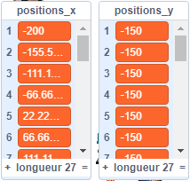

## Tester le script

\--- task \---

Pour tester le script, tu dois **appeler** le bloc personnalisé et lui fournir le nombre de `colonnes`{:class="block3myblocks"} que tu veux dans ta grille.

Ajoute ce code à ton sprite :

```blocks3
when flag clicked
generate positions (1) (10) ::custom
```

\--- /task \---

\--- task \---

Clique maintenant sur le drapeau vert pour exécuter ton code. Tu devrais voir tes deux listes remplies de valeurs.



Si tes résultats ne ressemblent pas à cela, reviens à l'étape précédente, jette un coup d'œil aux indices et essaie de corriger ton script.

\--- /task \---