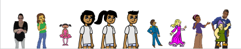

## Changer les costumes

Pour le moment, ton programme estampille le même costume de sprite encore et encore, et la taille du costume est trop grande.

--- task ---

Ajoute du code au bloc `estampiller les sprites`{:class="block3myblocks"} pour donner au sprite une une taille appropriée avant que la boucle `répéter`{:class="block3control"} ne commence. Ajoute un bloc à l'intérieur de la boucle pour basculer le bloc `costume suivant`{:class="block3looks"} après le bloc `estampiller`{:class="block3extensions"}.

```blocks3
define estampiller les sprites (lignes) (lignes)
set size to (40) %
set [index v] to [1]
repeat (lignes :: custom-arg)
go to x: (item (index) of [positions_x v]) y: (item (index) of [positions_y v]
stamp
next costume
change [index v] by (1)
```

--- /task ---

Lorsque tu exécutes le script maintenant, tu devrais voir quelque chose comme ceci :



Ton programme passe en revue tous les costumes dans l'ordre. Pour que chaque costume ne s'affiche pas au même endroit chaque fois que le programme s'exécute, tu devrais estampiller le sprite à des endroits aléatoires sur la grille.

Pour cela, tu dois suivre cet algorithme ****:

1. `Répéter`{:class="block3control"} jusqu'à ce que la liste soit vide
2. Définir l'`index`{:class="block3variables"} à un nombre `aléatoire`{:class="block3operators"} entre `1` et la longueur d'une liste
3. Déplacer le sprite comme tu l'as fait avant
4. Supprimer l'élément à l'`index`{:class="block3variables"} de la liste `positions_y`{:class="block3variables"}
5. Supprimer l'élément à l'`index`{:class="block3variables"} de la liste `positions_x`{:class="block3variables"}

--- task ---

Ajoute du code pour estampiller le sprite à des endroits aléatoires sur la grille.

--- hints ---
 --- hint ---

Supprime le `mettre index à 1`{:class="block3variables"} avant la boucle `répéter`{:class="block3control"}.

Puis dans la boucle, `mettre index à`{:class="block3variables"} un nombre `aléatoire`{:class="block3operators"} entre `1` et la `longueur de positions_x`{:class="block3variables"}.

Puis `supprime`{:class="block3variables"} l'élément à l'`index`{:class="block3variables"} des listes `positions_x`{:class="block3variables"} et `positions_y`{:class="block3variables"}.

--- /hint --- --- hint ---

Voici les blocs supplémentaires dont tu as besoin :

```blocks3
define estampiller les sprites (lignes) (lignes)
set size to (40) %
- set [index v] to [1]
repeat (lignes :: custom-arg)
go to x: (item (index) of [positions_x v]) y: (item (index) of [positions_y v]
stamp
next costume
- change [index v] by (1)
end

set [index v] to ()
(pick random () to ()
length of [positions_x v]
delete () of [positions_x v]

delete () of [positions_y v]
(index)
(index)
```

--- /hint --- --- hint ---

Voici à quoi ton code devrait ressembler :

```blocks3
define estampiller les sprites (lignes) (lignes)
set size to (40) %
- set [index v] to [1]
repeat (lignes :: custom-arg)
+ set [index v] to (pick random (1) to (length of [positions_x v]))
go to x: (item (index) of [positions_x v]) y: (item (index) of [positions_y v]
+ delete (index) of [positions_x v]
+ delete (index) of [positions_y v]
stamp
next costume
- change [index v] by (1)
```

--- /hint ------ /hints --- --- /task ---