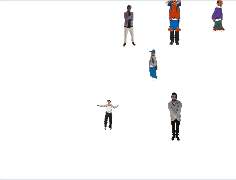

## Cacher ton sprite

Maintenant, il est temps de cacher ton sprite parmi la foule de tampons. Pour le moment, le sprite chevauche l'un des tampons.


--- task ---

Pour que cela ne se produit pas, fais en sorte que ta boucle de tampon s'exécute une fois de moins : `(lignes * colonnes) - 1`{:class="block3operators"}

```blocks3
define estampiller les sprites (lignes) (colonnes)
set size to (40) %
+repeat (((lignes :: custom-arg) * (colonnes :: custom-arg)) - (1))
set [index v] to (pick random (1) to (length of [positions_x v]))
go to x: (item (index) of [positions_x v]) y: (item (index) of [positions_y v]
delete (index) of [positions_x v]
delete (index) of [positions_y v]
stamp
next costume
```

--- /task ---

Si tu exécutes le script maintenant, tu peux voir que ton sprite se chevauche toujours avec un tampon et qu'il y a un trou dans ta grille. Et dans les listes `positions_x`{:class="block3variables"} et `positions_y`{:class="block3variables"}, il reste une position de coordonnées.

--- task ---

Pour terminer cette partie de ton jeu, va à la section `quand le drapeau est cliqué`{:class="block3events"} des scripts.

```blocks3
when flag clicked
erase all
générer les positions (4) (10) ::custom
estampiller les sprites (4) (10) ::custom
```

--- no-print ---

Voici une animation montrant ce qui devrait se passer :



--- /no-print ---

Au début du jeu, le sprite devrait apparaître plus grand et dire « Trouve-moi ». Puis le sprite devrait se cacher parmi les tampons dans l'espace vide que tu as laissé pour lui.

Vois si tu peux trouver comment faire cela, et utilise les indices ci-dessous si tu as besoin d'aide.

--- hints ---
 --- hint ---

C'est ce qu'il doit faire :

1. Envoie ton sprite à la position `x:0 y:0`{:class="block3motion"}
2. Amène le sprite en `avant`{:class="block3looks"} et définis sa `taille à 100%`{:class="block3looks"}
3. `Dis « Trouve-moi » pendant deux secondes`{:class="block3looks"}
4. `Reviens en arrière d'une couche`{:class="block3looks"}
5. Définis la taille du sprite `à 40%`{:class="block3looks"}
6. Déplace vers la dernière position restante dans les listes

--- /hint --- --- hint ---

Voici les blocs supplémentaires dont tu as besoin :

```blocks3
when flag clicked
erase all
générer les positions (4) (10) ::custom
estampiller les sprites (4) (10) ::custom

go to x: (0) y: (0)

go [backward v] (1) layers

go to [front v] layer

set size to (100) %

set size to (40) %

say [] for (2) seconds
item (1 v) of [positions_x v]
item (1 v) of [positions_y v]
go to x: () y: ()
```

--- /hint --- --- hint ---

Voici le script terminé `quand le drapeau vert est cliqué`{:class="block3events"} :

```blocks3
when flag clicked
erase all
générer les positions (4) (10) ::custom
estampiller les sprites (4) (10) ::custom
+go to x: (0) y: (0)
+go to [front v] layer
+set size to (100) %
+say [Trouve-moi] for (2) seconds
+go [backward v] (1) layers
+set size to (40) %
+ go to x: (item (1 v) of [positions_x v]) y: (item (1 v) of [positions_y v])
```

--- /hint ------ /hints --- --- /task ---