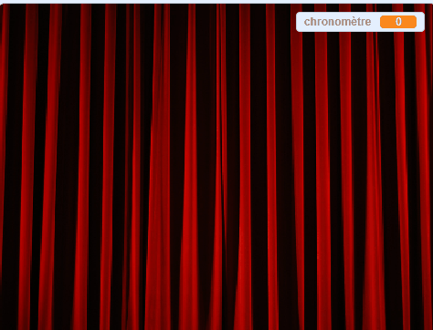

## Terminer la partie

\--- task \---

Pour terminer la partie, [trouve et télécharge une image d'un rideau de scène](https://www.google.co.uk/search?q=stage+curtain&source=lnms&tbm=isch&sa=X&ved=0ahUKEwjKg9O1k8_VAhXSL1AKHe1HDMIQ_AUICigB&biw=1362&bih=584){:target="_blank"}.

Importe cette image en tant que sprite.

[[[generic-scratch3-add-sprite-from-file]]]

\--- /task \---

\--- task \---

Positionne le nouveau sprite rideau sur `x:0 y:0`{:class="block3motion"}, puis change sa taille pour qu'il remplisse l'écran. Assure-toi qu'il est visible.

```blocks3
when flag clicked
go to x: (0) y: (0)
set size to (110) %
show
```

\--- /task \---

\--- task \---

Puis, dans les scripts de ton sprite de personnage, ajoute un script `envoyer à tous`{:class="block3events"} avec le message « rideau levé » à la fin du script `quand le drapeau est cliqué`{:class="block3events"}.

```blocks3
when flag clicked
erase all
generate positions (4) (10) ::custom
stamp sprites (4) (10) ::custom
go to x: (0) y: (0)
go to front
set size to (100) %
say [Find me] for (2) seconds
go back (1) layers
set size to (40) %
go to x: (item (1 v) of [x_positions v]) y: (item (1 v) of [y_positions v])
+broadcast (curtain up v)
```

\--- /task \---

\--- task \---

Quand le sprite de rideau reçoit l'`envoyer à tous`{:class="block3events"}, le sprite a besoin de se déplacer vers le haut pendant 10 secondes pour donner l'effet du lever de rideau pour révéler les tampons. Puis le rideau devrait tomber à nouveau, de sorte que le sprite de rideau doit se déplacer vers le bas.

\--- no-print \---

Ça devrait ressembler à ceci :



\--- /no-print \---

Essaie de le faire par toi-même, et utilise les indices si tu as besoin d'aide.

\--- hints \--- \--- hint \---

Pour le sprite rideau, tu as besoin d'un script qui fait les choses suivantes :

1. Quand le sprite de rideau reçoit l'`envoyer à tous`{:class="block3events"}
2. Faire passer le sprite du rideau à l'`avant`{:class="block3looks"}
3. `Attendre`{:class="block3control"} un peu pendant que les costumes de sprite de personnage sont estampillés
4. `Glisser`{:class="block3motion"} le sprite de rideau vers le haut pour qu'il se retrouve près du haut de la scène
5. `Cacher`{:class="block3looks"} le rideau
6. Démarrer une boucle qui compte à rebours pendant 10 secondes
7. Lorsque le temps est écoulé, `montrer`{:class="block3looks"} le sprite du rideau
8. `Glisser`{:class="block3motion"} le sprite du rideau à sa position d'origine

\--- /hint \--- \--- hint \---

Voici les blocs dont tu auras besoin :

```blocks3
go to front

show

hide

glide (1) secs to x: (0) y: (0)

glide (1) secs to x: (0) y: (0)

set [timer v] to []

change [timer v] by ()

wait () secs

wait () secs

repeat ()
end
when I receive [curtain up v]
```

\--- /hint \--- \--- hint \---

Voici le script terminé :

```blocks3
when I receive [curtain up v]
go to front
wait (1) seconds
glide (1) secs to x: (0) y: (300)
hide
set [timer v] to [10]
repeat (10)
wait (1) seconds
change [timer v] by (-1)
end
show
glide (1) secs to x: (0) y: (0)
```

\--- /hint \--- \--- /hints \--- \--- /task \---

La dernière partie est de faire savoir au joueur s'il a gagné.

\--- task \---

Dans les scripts pour le sprite du personnage, ajoute du code de sorte que, lorsque le sprite est cliqué, le sprite dit `Tu m'as trouvé`{:class="block3looks"}, et tous les scripts du jeu s'arrêtent.

```blocks3
when this sprite clicked
say [You found me]
stop [all v]
```

\--- /task \---