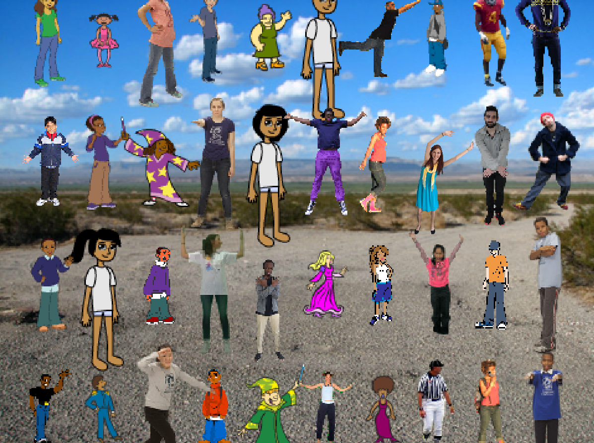

\--- no-print \---

यह इस प्रोजेक्ट का **Scratch 3** संस्करण है। [इस प्रोजेक्ट का Scratch 2 संस्करण](https://projects.raspberrypi.org/en/projects/lineup-scratch2) भी है।

\--- /no-print \---

## परिचय

इस प्रोजेक्ट में आप एक Scratch गेम बनाएँगे जिसमें आपको एक sprite को खोजना होगा जो अन्य पात्रों की भारी भीड़ के बीच छिपा हुआ है।

### आप क्या बनाएँगे

\--- no-print \---

Click on the green flag and, once the curtain is up, try and find the sprite before your time runs out.

  <iframe allowtransparency="true" width="485" height="402" src="https://scratch.mit.edu/projects/embed/259020474/?autostart=false" frameborder="0" scrolling="no"></iframe>

\--- /no-print \---

\--- print-only \---

You have to find the right sprite amongst all these characters before your time runs out.

\--- /print-only \---

## \--- collapse \---

## title: आप क्या सीखेंगे

+ इनपुट वाले कस्टम ब्लॉक कैसे बनाएँ
+ ग्रिड निर्देशांकों को संगृहीत करने के लिए सूचियों का उपयोग कैसे करें
+ How to use loops to cycle over items in a list

\--- /collapse \---

## \--- collapse \---

## title: आपको किन चीज़ों की आवश्यकता होगी

### हार्डवेयर

+ Scratch 3 चलाने में सक्षम कंप्यूटर

### सॉफ्टवेयर

+ Scratch 3 (either [online](http://rpf.io/scratchon){:target="_blank"} or [offline](http://rpf.io/scratchoff){:target="_blank"})

\--- /collapse \---

## \--- collapse \---

## title: शिक्षकों के लिए अतिरिक्त टिप्पणियाँ

\--- no-print \---

If you need to print this project, please use the [printer-friendly version](https://projects.raspberrypi.org/en/projects/lineup/print).

\--- /no-print \---

You can find the [completed project here](http://rpf.io/p/en/lineup-get){:target="_blank"}.

\--- /collapse \---