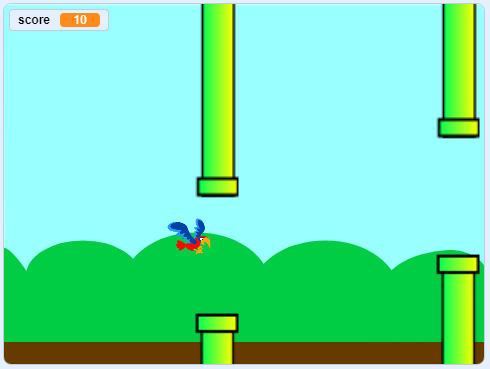

## आगे क्या?

[Flappy parrot](https://projects.raspberrypi.org/en/projects/flappy-parrot?utm_source=pathway&utm_medium=whatnext&utm_campaign=projects) प्रोजेक्ट आज़माएँ, जिसमें आप एक और गेम बनाएँगे।

\--- no-print \---

गेम शुरू करने के लिए हरे झंडे पर क्लिक करें। तोता अपने पंखों को फड़फड़ाए इसके लिए <kbd>space</kbd> (स्पेस) बार दबाएँ, और उसे पाइपों में खाली जगहों के बीच में से उड़ने देने की कोशिश करें! आपको हर उस पाइप के लिए एक अंक मिलता है जिसमें से आप तोते को निकाल ले जाने में सफल हो जाते हैं।

  <iframe allowtransparency="true" width="485" height="402" src="https://scratch.mit.edu/projects/embed/258349724/?autostart=false" frameborder="0" scrolling="no"></iframe>
  

\--- /no-print \---

\--- print-only \---

-तोता अपने पंखों को फड़फड़ाए इसके लिए आप <kbd>space</kbd> (स्पेस) बार दबाएँगे, और आपको हर उस पाइप के लिए एक अंक मिलता है जिसमें से आप तोते को निकाल ले जाने में सफल हो जाते हैं।

\--- /print-only \---