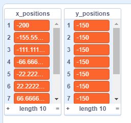

## स्क्रिप्ट का परीक्षण करें

\--- task \---

स्क्रिप्ट का परीक्षण करने के लिए, आपको कस्टम ब्लॉक को **कॉल** करना होता है और आपको इसमें `columns`{:class="block3myblocks"} की संख्या देनी होती है जिन्हें आप अपने ग्रिड में चाहते हैं।

इस कोड को अपने स्प्राइट में जोड़ें:

```blocks3
when flag clicked
generate positions (1) (10) ::custom
```

\--- /task \---

\--- task \---

अब अपना कोड चलाने के लिए हरी झंडी पर क्लिक करें। आपको अपनी दो सूचियों में मान भरे हुए दिखाई देने चाहिए।



यदि आपके परिणाम इस तरह नहीं दिखते हैं, तो पिछले चरण पर वापस जाएँ, संकेतों को देखें और अपनी स्क्रिप्ट को ठीक करने का प्रयास करें।

\--- /task \---