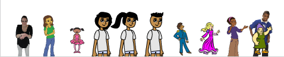

## परिधान बदलें

फिलहाल, आपका प्रोग्राम स्प्राइट के उसी परिधान पर बार बार मोहर लगाता है, और परिधान का आकार बहुत बड़ा है।

\--- task \---

Add code to the `stamp sprites`{:class="block3myblocks"} block to make the sprite a suitable size before the `repeat`{:class="block3control"} loop starts. Add a block inside the loop to switch the `next costume`{:class="block3looks"} after the `stamp`{:class="block3extensions"} block.

```blocks3
define stamp sprites (rows) (columns)
set size to (40) %
set [index v] to [1]
repeat (columns :: custom-arg)
go to x: (item (index) of [x_positions v]) y: (item (index) of [y_positions v]
stamp
next costume
change [index v] by (1)
```

\--- /task \---

When you run the script now, you should see something like this:



Your program cycles through all the costumes in order. So that each costume does not show up in the same place every time the program runs, you should stamp the sprite in random places on the grid.

To do this, you need to follow this **algorithm**:

1. `Repeat`{:class="block3control"} जब तक सूची खाली न हो जाए
2. `index`{:class="block3variables"} को `1` और सूची की लंबाई के बीच किसी `random`{:class="block3operators"} संख्या पर पर सेट करें
3. स्प्राइट को आगे ले जाएँ जैसा आपने पहले किया था
4. `index`{:class="block3variables"} स्थिति की आइटम को `y_positions`{:class="block3variables"} सूची में से हटाएँ
5. `x_positions`{:class="block3variables"} सूची में से `index`{:class="block3variables"} स्थिति की मद को हटाएँ

\--- task \---

Add code to stamp the sprite in random places on the grid.

\--- hints \--- \--- hint \---

Remove the `set index to 1`{:class="block3variables"} from before the `repeat`{:class="block3control"} loop.

Then within the loop, `set index to`{:class="block3variables"} a `random`{:class="block3operators"} number between `1` and the `length of x_positions`{:class="block3variables"}.

Then `delete`{:class="block3variables"} the item at the `index`{:class="block3variables"} from both the `x_positions`{:class="block3variables"} and `y_positions`{:class="block3variables"} lists.

\--- /hint \--- \--- hint \---

Here are the additional blocks you need:

```blocks3
define stamp sprites (rows) (columns)
set size to (40) %
- set [index v] to [1]
repeat (columns :: custom-arg)
go to x: (item (index) of [x_positions v]) y: (item (index) of [y_positions v]
stamp
next costume
- change [index v] by (1)
end

set [index v] to ()
(pick random () to ()
length of [x_positions v]
delete () of [x_positions v]

delete () of [y_positions v]
(index)
(index)
```

\--- /hint \--- \--- hint \---

This is what your code should look like:

```blocks3
define stamp sprites (rows) (columns)
set size to (40) %
- set [index v] to [1]
repeat (columns :: custom-arg)
+ set [index v] to (pick random (1) to (length of [x_positions v]))
go to x: (item (index) of [x_positions v]) y: (item (index) of [y_positions v]
+ delete (index) of [x_positions v]
+ delete (index) of [y_positions v]
stamp
next costume
- change [index v] by (1)
```

\--- /hint \--- \--- /hints \--- \--- /task \---