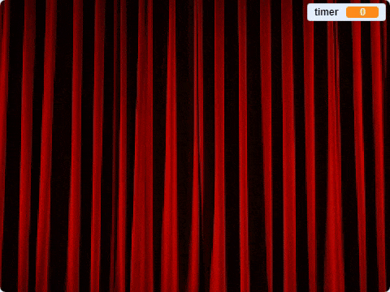

## गेम समाप्त करें

--- task ---

गेम समाप्त करने के लिए, [मंच के पर्दे की एक छवि खोजें और डाउनलोड करें](https://www.google.co.uk/search?q=stage+curtain&source=lnms&tbm=isch&sa=X&ved=0ahUKEwjKg9O1k8_VAhXSL1AKHe1HDMIQ_AUICigB&biw=1362&bih=584){:target="_blank"} का उपयोग करें।

इस छवि को स्प्राइट के रूप में आयात करें।

[[[generic-scratch3-add-sprite-from-file]]]

--- /task ---

--- task ---

नया पर्दा स्प्राइट को `x:0 y:0`{:class="block3motion"} स्थिति में लाएँ,और फिर इसका आकार बदल दें ताकि यह स्क्रीन को भर दे। सुनिश्चित करें कि यह दिखाई देता है।

```blocks3
when flag clicked
go to x: (0) y: (0)
set size to (110) %
show
```

--- /task ---

--- task ---

फिर,अपने पात्र स्प्राइट के लिए स्क्रिप्ट में, `when flag clicked`{:class="block3events"} स्क्रिप्ट के अंत में 'पर्दा उठाएँ' संदेश के साथ `broadcast`{:class="block3events"} जोड़ें।

```blocks3
when flag clicked
erase all
generate positions (4) (10) ::custom
stamp sprites (4) (10) ::custom
go to x: (0) y: (0)
go to front
set size to (100) %
say [Find me] for (2) seconds
go back (1) layers
set size to (40) %
go to x: (item (1 v) of [x_positions v]) y: (item (1 v) of [y_positions v])
+broadcast (curtain up v)
```

--- /task ---

--- task ---

जब पर्दा स्प्राइट `broadcast`{:class="block3events"} प्राप्त करता है, तो स्प्राइट को 10 सेकंड के लिए ऊपर की ओर उठना होता है जिससे ऐसा लगे कि मोहरें दिखाने के लिए पर्दा उठा हुआ है। फिर पर्दे को दुबारा से नीचे गिरना चाहिए, इसलिए पर्दा स्प्राइट को नीचे की ओर जाने की आवश्यकता है।

--- no-print ---

या फिर ऐसी भी दिख सकती हैं:



--- /no-print ---

आप स्वयं ऐसा करने की कोशिश करें, और यदि आपको सहायता की आवश्यकता हो तो सुझावों का उपयोग करें।

--- hints ---
 --- hint ---

पर्दा स्प्राइट के लिए, आपको एक स्क्रिप्ट की ज़रूरत है जो निम्नलिखित चीजें करती हो:

1. जब पर्दा स्प्राइट को `broadcast`{:class="block3events"} प्राप्त हो जाए
2. पर्दा स्प्राइट को `front`{:class="block3looks"} पर लाएँ
3. पात्र स्प्राइट के परिधानों पर मोहर लगाए जाते समय थोड़ी प्रतीक्षा करने के लिए `Wait`{:class="block3control"} का उपयोग करें
4. पर्दा स्प्राइट को ऊपर की ओर `Glide`{:class="block3motion"} करें ताकि यह स्टेज के ऊपर की ओर जाकर समाप्त हो
5. पर्दे को छिपाने के लिए `Hide`{:class="block3looks"} का उपयोग करें
6. एक लूप शुरू करें जो 10 सेकंड के लिए उलटी गिनती करे
7. जब समय समाप्त हो जाए, तो पर्दा स्प्राइट को दिखाने के लिए `show`{:class="block3looks"} का उपयोग करें
8. `Glide`{:class="block3motion"} पर्दा अपनी मूल स्थिति में वापस आ जाता है

--- /hint --- --- hint ---

इन ब्लॉक्स की आपको आवश्यकता होगी:

```blocks3
go to front

show

hide

glide (1) secs to x: (0) y: (0)

glide (1) secs to x: (0) y: (0)

set [timer v] to []

change [timer v] by ()

wait () secs

wait () secs

repeat ()
end
when I receive [curtain up v]
```

--- /hint --- --- hint ---

यह पूरी स्क्रिप्ट है:

```blocks3
when I receive [curtain up v]
go to front
wait (1) seconds
glide (1) secs to x: (0) y: (300)
hide
set [timer v] to [10]
repeat (10)
wait (1) seconds
change [timer v] by (-1)
end
show
glide (1) secs to x: (0) y: (0)
```

--- /hint ------ /hints --- --- /task ---

एकदम आखिरी हिस्सा खिलाड़ी को यह बताने के लिए है कि क्या वे जीत गए हैं।

--- task ---

पात्र स्प्राइट की स्क्रिप्ट में कोड जोड़ें, ताकि स्प्राइट को क्लिक करने पर स्प्राइट यह कहे कि आपने मुझे ढूँढ लिया है, इसके लिए `You've found me`{:class="block3looks"} का उपयोग करें, और गेम की सभी स्क्रिप्ट रुक जाती हैं।

```blocks3
when this sprite clicked
say [You found me]
stop [all v]
```

--- /task ---