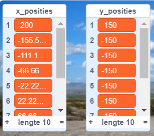

## Test het script

--- task ---

Om het script te testen, heb je een **aanroep** van je blok nodig en dit voorzien van het aantal `kolommen`{:class="block3myblocks"} dat je in je raster wilt.

Voeg deze code toe aan je sprite:

```blocks3
wanneer op de groene vlag wordt geklikt
genereer posities (1) (10) ::custom
```

--- /task ---

--- task ---

Klik nu op de groene vlag om je code uit te voeren. Je zou je twee lijsten met waarden gevuld moeten zien.



Als je resultaten er niet zo uitzien, ga dan terug naar de vorige stap, bekijk de hints en probeer je script te verbeteren.

--- /task ---