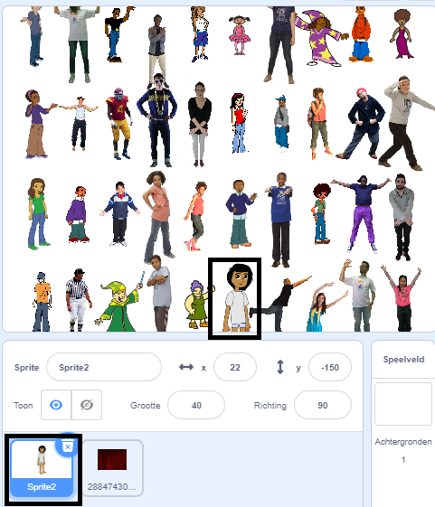

## Verberg je sprite

Nu is het tijd om je sprite te verbergen tussen de menigte stempels. Op dit moment overlapt de sprite een van de stempels.



--- task ---

Zodat dit niet gebeurt, laat je stempellus één keer minder lopen: `(rijen * kolommen) - 1`{:class="block3operators"}

```blocks3
define stempel sprites (rijen) (kolommen)
maak grootte (40) %
+ herhaal (((rijen :: custom-arg) * (kolommen :: custom-arg)) - (1))
maak [index v] (willekeurig getal tussen (1) en (lengte van [x_posities v]))
ga naar x: (item (index) van [x_posities v]) y: (item (index) van [y_posities v]
verwijder (index ) van [x_posities v]
verwijder (index) van [y_posities v]
stempel
volgend uiterlijk
```

--- /task ---

Als je het script nu uitvoert, kun je zien dat je sprite nog steeds overlapt met een stempel en dat er een gat in je raster zit. En in de lijsten `x_posities`{:class="block3variables"} en `y_posities`{:class="block3variables"} is er nog een coördinaatpositie over.

--- task ---

Om dit deel van je spel te voltooien, ga je naar het `wanneer op de groene vlag wordt geklikt`{:class="block3events"} gedeelte.

```blocks3
when flag clicked
wis alles
genereer posities (4) (10) ::custom
stempel sprites (4) (10) ::custom
```

--- no-print ---

Hier is een animatie die laat zien wat er moet gebeuren:


--- /no-print ---

Aan het begin van het spel moet de sprite groot verschijnen en zeggen "Zoek me". Dan zou de sprite zich tussen de stempels moeten verbergen in de lege ruimte die je daarvoor over hebt.

Kijk of je erachter kunt komen hoe je dit kunt doen en gebruik de onderstaande tips als je hulp nodig hebt.

--- hints ---
 --- hint ---

Dit is wat het moet doen:

1. Stuur je sprite naar `x:0 y:0`{:class="block3motion"}
2. Breng de sprite naar `voren`{:class="block3looks"} en stel de `grootte in op 100%`{:class="block3looks"}
3. `Zeg 'Zoek me' 2 sec.`{:class="block3looks"}
4. `Ga naar achteren 1 lagen`{:class="block3looks"}
5. Stel de sprite's `grootte in op 40%`{:class="block3looks"}
6. Ga naar de laatst overgebleven positie in de lijsten

--- /hint --- --- hint ---

Dit zijn de extra blokken die je nodig hebt:

```blocks3
when flag clicked
erase all
genereer posities (4) (10) ::custom
stempel sprites (4) (10) ::custom

go to x: (0) y: (0)

go [backward v] (1) layers

go to [front v] layer

set size to (100) %

set size to (40) %

say [] for (2) seconds
item (1 v) of [x_posities v]
item (1 v) of [y_posities v]
go to x: () y: ()
```

--- /hint --- --- hint ---

Hier is het voltooide `wanneer op de groene vlag wordt geklikt`{:class="block3events"} script:

```blocks3
when flag clicked
erase all
genereer posities (4) (10) ::custom
stempel sprites (4) (10) ::custom
+go to x: (0) y: (0)
+go to [front v] layer
+set size to (100) %
+say [Zoek me] for (2) seconds
+go [backward v] (1) layers
+set size to (40) %
+ go to x: (item (1 v) of [x_posities v]) y: (item (1 v) of [y_posities v])
```

--- /hint ------ /hints --- --- /task ---