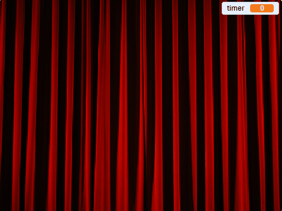

## Maak het spel af

--- task ---

Om het spel te beëindigen, [zoek en download een afbeelding van een podiumgordijn](https://www.google.co.uk/search?q=stage+curtain&source=lnms&tbm=isch&sa=X&ved=0ahUKEwjKg9O1k8_VAhXSL1AKHe1HDMIQ_AUICigB&biw=1362&bih=584){:target="_blank"}.

Importeer deze afbeelding als sprite.

[[[generic-scratch3-add-sprite-from-file]]]

--- /task ---

--- task ---

Plaats de nieuwe gordijn sprite op `x:0 y:0`{:class="block3motion"} en wijzig vervolgens de grootte zodat deze het speelveld vult. Zorg ervoor dat het zichtbaar is.

```blocks3
when flag clicked
ga naar x: (0) y: (0)
maak grootte (110) %
verschijn
```

--- /task ---

--- task ---

Voeg vervolgens in de scripts voor je personage sprite een `zend signaal`{:class="block3events"} toe met het bericht 'gordijn omhoog' aan het einde van het `wanneer op de groene vlag wordt geklikt`{:class="block3events"} script.

```blocks3
when flag clicked
wis alles
genereer posities (4) (10) ::custom
stempel sprites (4) (10) ::custom
ga naar x: (0) y: (0)
go to front
maak grootte (100) %
zeg [Zoek me] (2) sec.
go back (1) layers
maak grootte (40) %
ga naar x: (item (1 v) van [x_posities v]) y: (item (1 v) van [y_posities v])
+ zend signaal (gordijn omhoog v)
```

--- /task ---

--- task ---

Wanneer de gordijn sprite het `signaal`{:class="block3events"} ontvangt, moet de sprite 10 seconden omhoog gaan zodat het lijkt alsof het gordijn omhoog wordt gehesen om de stempels te onthullen. Dan zou het gordijn weer moeten vallen, dus de gordijn sprite moet naar beneden bewegen.

--- no-print ---

Het zou er zo uit moeten zien:



--- /no-print ---

Probeer dit zelf te doen en gebruik de hints als je hulp nodig hebt.

--- hints ---
 --- hint ---

Voor de gordijn sprite heb je een script nodig dat de volgende dingen doet:

1. Wanneer de gordijn sprite het `signaal`{:class="block3events"} ontvangt
2. Breng de gordijn sprite naar de `voorgrond`{:class="block3looks"}
3. `Wacht`{:class="block3control"} even terwijl de sprite uiterlijken worden gestempeld
4. `Hijs`{:class="block3motion"} de gordijn sprite omhoog zodat het in de buurt van de bovenkant van het speelveld belandt
5. `Verberg`{:class="block3looks"} het gordijn
6. Start een lus die 10 seconden aftelt
7. Wanneer de tijd voorbij is, `verschijnt`{:class="block3looks"} de sprite van het gordijn
8. `Zet`{:class="block3motion"} de gordijn sprite terug naar de oorspronkelijke positie

--- /hint --- --- hint ---

Dit zijn de blokken die je nodig hebt:

```blocks3
go to front

verschijn

verdwijn

schuif in (1) sec. naar x: (0) y: (0)

schuif in (1) sec. naar x: (0) y: (0)

maak [timer v] []

verander [timer v] met ()

wacht () sec.

wacht () sec.

herhaal ()
einde
wanneer ik signaal [gordijn omhoog v] ontvang
```

--- /hint --- --- hint ---

Dit is het voltooide script:

```blocks3
wanneer ik signaal [gordijn omhoog v] ontvang
go to front
wacht (1) sec.
schuif in (1) sec. naar x: (0) y: (300)
verdwijn
maak [timer v] [10]
herhaal (10)
wacht (1) sec.
verander [timer v] met (-1)
einde
verschijn
schuif in (1) sec. naar x: (0) y: (0)
```

--- /hint ------ /hints --- --- /task ---

Het allerlaatste onderdeel is om de speler te laten weten of hij heeft gewonnen.

--- task ---

Voeg in de scripts voor het karakter sprite code toe zodat, wanneer op de sprite wordt geklikt, de sprite zegt `Je hebt me gevonden`{:class="block3looks"} en alle scripts in het spel stoppen.

```blocks3
wanneer op deze sprite wordt geklikt
zeg [Je hebt me gevonden]
stop [alle v]
```

--- /task ---