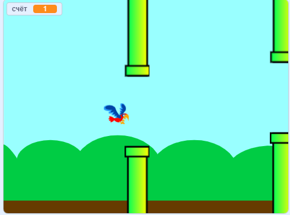

## Что дальше?

Попробуй проект [Порхающий попугай](https://projects.raspberrypi.org/en/projects/flappy-parrot?utm_source=pathway&utm_medium=whatnext&utm_campaign=projects), в котором ты создашь другую игру.

\--- no-print \---

Нажми на зеленый флаг, чтобы начать. Нажми клавишу <kbd>пробел</kbd>, чтобы попугай взмахивал крыльями, и заставь его пролететь между трубами! Ты получишь одно очко за каждую трубу, через которую тебе удастся провести попугая.

  <iframe allowtransparency="true" width="485" height="402" src="https://scratch.mit.edu/projects/embed/258349724/?autostart=false" frameborder="0" scrolling="no"></iframe>
  

\--- /no-print \---

\--- print-only \---

Тебе нужно будет нажимать на клавишу <kbd>пробел</kbd>, чтобы попугай взмахивал крыльями, и за каждую трубу, через которую тебе удастся провести попугая, будет добавляться очко.

\--- /print-only \---