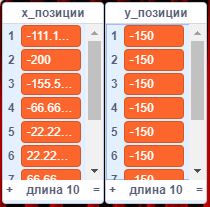

## Проверь скрипт

--- task ---

Чтобы протестировать скрипт, тебе нужно **вызвать** пользовательский блок и передать ему количество `столбцов`{:class="block3myblocks"}, которое ты желаешь иметь в твоей сетке.

Добавь этот код своему спрайту:

```blocks3
when flag clicked
генерировать позиции (1) (10) ::custom
```

--- /task ---

--- task ---

Теперь нажми на зеленый флаг, чтобы запустить свой код. Ты должен увидеть два списка со значениями.



Если твои результаты не выглядят так, вернись к предыдущему шагу, взгляни на подсказки и попробуй исправить свой скрипт.

--- /task ---