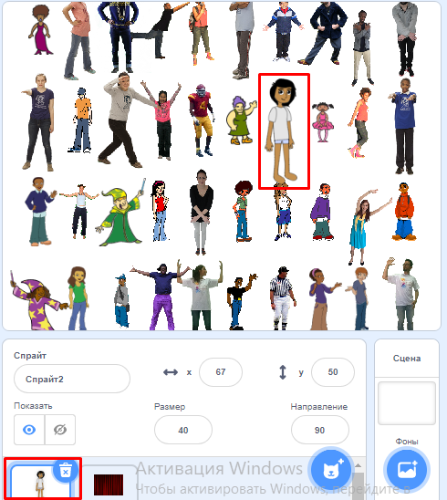
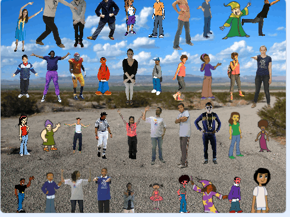

## Скрой свой спрайт

Теперь пришло время спрятать свой спрайт среди множества штампов. На данный момент спрайт перекрывает один из штампов.



\--- task \---

Чтобы это не происходило, сделай так, чтобы твой цикл печати выполнялся на один раз меньше: `(строки * столбцы) - 1`{:class="block3operators"}

```blocks3
define stamp sprites (rows) (columns)
set size to (40) %
+repeat (((rows :: custom-arg) * (columns :: custom-arg)) - (1))
set [index v] to (pick random (1) to (length of [x_positions v]))
go to x: (item (index) of [x_positions v]) y: (item (index) of [y_positions v]
delete (index) of [x_positions v]
delete (index) of [y_positions v]
stamp
next costume
```

\--- /task \---

Если ты запустишь скрипт сейчас, то увидишь, что спрайт все еще перекрывается штампом, и в сетке есть дыра. И в списках `x_позиции`{:class="block3variables"} и `y_позиции`{:class="block3variables"} осталась одна координата.

\--- task \---

To finish this part your game, go to the `when flag clicked`{:class="block3events"} section of the scripts.

```blocks3
when flag clicked
erase all
generate positions (4) (10) ::custom
stamp sprites (4) (10) ::custom
```

\--- no-print \---

Here's an animation showing what should happen:



\--- /no-print \---

At the start of the game, the sprite should appear at a large size and say "Find me". Then the sprite should hide itself among the stamps in the empty space you have left for it.

See if you can figure out how to do this, and use the hints below if you need help.

\--- hints \--- \--- hint \---

This is what it needs to do:

1. Send your sprite to `x:0 y:0`{:class="block3motion"}
2. Bring the sprite to the `front`{:class="block3looks"} and set its `size to 100%`{:class="block3looks"}
3. `Say 'Find me' for two seconds`{:class="block3looks"}
4. `Go back one layer`{:class="block3looks"}
5. Set the sprite's `size to 40%`{:class="block3looks"}
6. Move to the last remaining position in the lists

\--- /hint \--- \--- hint \---

These are the additional blocks you need:

```blocks3
when flag clicked
erase all
generate positions (4) (10) ::custom
stamp sprites (4) (10) ::custom

go to x: (0) y: (0)

go back (1) layers

go to front

set size to (100) %

set size to (40) %

say [] for (2) seconds
item (1 v) of [x_positions v]
item (1 v) of [y_positions v]
go to x: () y: ()
```

\--- /hint \--- \--- hint \---

Here is the completed `when flag clicked`{:class="block3events"} script:

```blocks3
when flag clicked
erase all
generate positions (4) (10) ::custom
stamp sprites (4) (10) ::custom
+go to x: (0) y: (0)
+go to front
+set size to (100) %
+say [Find me] for (2) seconds
+go back (1) layers
+set size to (40) %
+ go to x: (item (1 v) of [x_positions v]) y: (item (1 v) of [y_positions v])
```

\--- /hint \--- \--- /hints \--- \--- /task \---