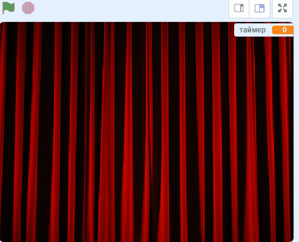

## Заверши игру

--- task ---

Чтобы закончить игру, [найди и загрузи изображение занавеса сцены](https://www.google.co.uk/search?q=stage+curtain&source=lnms&tbm=isch&sa=X&ved=0ahUKEwjKg9O1k8_VAhXSL1AKHe1HDMIQ_AUICigB&biw=1362&bih=584){:target="_blank"}.

Импортируй это изображение как спрайт.

[[[generic-scratch3-add-sprite-from-file]]]

--- /task ---

--- task ---

Помести новый спрайт занавеса в `x: 0 y: 0`{:class="block3motion"}, а затем измени его размер так, чтобы он занимал весь экран. Убедись, что его видно.

```blocks3
when flag clicked
go to x: (0) y: (0)
set size to (110) %
show
```

--- /task ---

--- task ---

Затем в скрипте для вашего персонажа спрайта добавь `передать`{:class="block3events"} сообщение «занавес вверх» в конец скрипта `когда флаг нажат`{:class="block3events"}.

```blocks3
when flag clicked
erase all
генерировать позиции (4) (10) ::custom
печатать спрайты (4) (10) ::custom
go to x: (0) y: (0)
go to front
set size to (100) %
say [Найди меня] for (2) seconds
go back (1) layers
set size to (40) %
go to x: (item (1 v) of [x_позиции v]) y: (item (1 v) of [y_позиции v])
+broadcast (занавес вверх v)
```

--- /task ---

--- task ---

Когда спрайт занавеса получает `передачу`{:class="block3events"}, ему нужно переместиться вверх на 10 секунд, чтобы было похоже, что занавес поднят, чтобы показать штампы. Затем занавес должен снова опуститься, поэтому спрайту занавеса нужно двигаться вниз.

--- no-print ---

Должно получиться примерно так:



--- /no-print ---

Попробуй сделать это самостоятельно и используй подсказки, если будет нужна помощь.

--- hints ---
 --- hint ---

Для спрайта занавеса нужен скрипт, который выполняет следующие действия:

1. Когда спрайт занавеса получает `передачу`{:class="block3events"}
2. Перенеси спрайт занавеса `вперед`{:class="block3looks"}
3. `Ждать`{:class="block3control"} немного, пока костюмы спрайтов персонажей будут отпечатаны
4. `Скользить`{:class="block3motion"} спрайт занавеса вверх так, чтобы он дошел до верхней части Сцены
5. `Скрыть`{:class="block3looks"} занавес
6. Начать цикл, который ведет обратный отсчет в течение 10 секунд
7. Когда время закончится, `показать`{:class="block3looks"} спрайт занавеса
8. `Скользить`{:class="block3motion"} спрайт занавеса и вернуть его в исходное положение

--- /hint --- --- hint ---

Вот блоки, которые тебе понадобятся:

```blocks3
go to front

show

hide

glide (1) secs to x: (0) y: (0)

glide (1) secs to x: (0) y: (0)

set [таймер v] to []

change [таймер v] by ()

wait () secs

wait () secs

repeat ()
end
when I receive [занавес вверх v]
```

--- /hint --- --- hint ---

Это законченный скрипт:

```blocks3
when I receive [занавес вверх v]
go to front
wait (1) seconds
glide (1) secs to x: (0) y: (300)
hide
set [таймер v] to [10]
repeat (10)
wait (1) seconds
change [таймер v] by (-1)
end
show
glide (1) secs to x: (0) y: (0)
```

--- /hint ------ /hints --- --- /task ---

Последняя часть — сообщить игроку, выиграли ли он.

--- task ---

В сценарии для персонажа спрайта добавь код, который при нажатии на спрайт спрайт говорит `Ты нашел меня`{:class="block3looks"}, и все скрипты в игре останавливаются.

```blocks3
when this sprite clicked
say [Ты нашел меня]
stop [all v]
```

--- /task ---